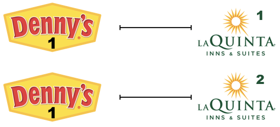

# Getting started

* Open RStudio. Navigate to File > New Project..., and select "New Directory", then "New Project". Name your directory something like "hw-05" and save it as a subdirectory of your STAT 408 folder on your computer. Click "Create Project".
* Download the [R Markdown document `hw-05.Rmd`](hw-05.Rmd) from the course calendar and save it to your newly created "hw-05" folder.
* Open the `hw-05.Rmd` document in RStudio. Update the YAML, changing the author name to your name, and **knit** the document to PDF.
* Make sure it compiles without errors. The output will be in the `.pdf` file with the same name in the same directory.

# Part I: La Quinta is Spanish for next to Denny's, Pt. 1

Let's revisit the Denny's and La Quinta Inn and Suites data we visualized in the previous lab.
Remember that the datasets we'll use are called `dennys` and `laquinta` from the **dsbox** package.

1.  Filter the Denny's dataframe for Alaska (AK) and save the result as `dn_ak`. How many Denny's locations are there in Alaska?


2.  Filter the La Quinta dataframe for Alaska (AK) and save the result as `lq_ak`. How many La Quinta locations are there in Alaska?


Next we'll calculate the distance between all Denny's and all La Quinta locations in Alaska.
Let's take this step by step:

**Step 1:** There are 3 Denny's and 2 La Quinta locations in Alaska.
(If you answered differently above, you might want to recheck your answers.)

{width="300px" height="300px"}

**Step 2:** Let's focus on the first Denny's location.
We'll need to calculate two distances for it: (1) distance between Denny's 1 and La Quinta 1 and (2) distance between Denny's 1 and La Quinta (2).

{width="300px" height="150px"}

**Step 3:** Now let's consider all Denny's locations.

{width="300px" height="450px"}

3.  How many pairings are there between all Denny's and all La Quinta locations in Alaska, i.e., how many distances do we need to calculate between the locations of these establishments in Alaska?

In order to calculate these distances we need to first restructure our data to pair the Denny's and La Quinta locations.
To do so, we will join the two data frames.

4. Join the two data sets `dn_ak` and `lq_ak` into a single data set named `dn_lq_ak`. Keep all rows and columns from both `dn_ak` and `lq_ak` data frames.


5.  How many observations are in the joined `dn_lq_ak` data frame? What are the names of the variables in this data frame.


Now that we have the data in the format we wanted, all that is left is to calculate the distances between the pairs.
One way of calculating the distance between any two points on the earth is to use the Haversine distance formula.
This formula takes into account the fact that the earth is not flat, but instead spherical.

This function is not available in R, but we have it saved in a file called `haversine.R` that we can load and then use:

```{r}
haversine <- function(long1, lat1, long2, lat2, round = 3) {
  # convert to radians
  long1 = long1 * pi / 180
  lat1  = lat1  * pi / 180
  long2 = long2 * pi / 180
  lat2  = lat2  * pi / 180
  
  R = 6371 # Earth mean radius in km
  
  a = sin((lat2 - lat1)/2)^2 + cos(lat1) * cos(lat2) * sin((long2 - long1)/2)^2
  d = R * 2 * asin(sqrt(a))
  
  return( round(d,round) ) # distance in km
}
```

This function takes five arguments:

-   Longitude and latitude of the first location
-   Longitude and latitude of the second location
-   A parameter by which to round the responses

6. The code for the `haversine` function is included in the `hw-05.Rmd` template.
Adding to the code, document this function with (1) a description, (2) summary of input(s), and (3) summary of outputs.

7.  Calculate the distances between all pairs of Denny's and La Quinta locations and save this variable as `distance`.
    Make sure to save this variable in THE `dn_lq_ak` data frame so that you can use it later.

8.  Calculate the minimum distance between a Denny's and La Quinta for each Denny's location.
    To do so, you will need to group by Denny's locations (addresses) and calculate a new variable called `closets` that stores the information for the minimum distance.

9.  Describe the distribution of the distances between Denny's and the nearest La Quinta locations in Alaska. Also include an appropriate visualization and relevant summary statistics.

10. Repeat the same analysis for a state of your choosing, different than the ones we covered so far: (i) filter Denny's and La Quinta Data Frames for your chosen state, (ii) join these data frames to get a complete list of all possible pairings, (iii) calculate the distances between all possible pairings of Denny's and La Quinta in your chosen state, (iv) find the minimum distance between each Denny's and La Quinta location, (v) visualize and describe the distribution of these shortest distances using appropriate summary statistics.


# Part II: Take a sad plot and make it better

