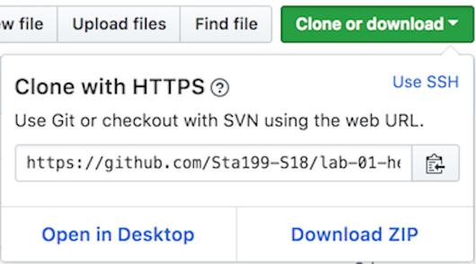

# Learning goals

```{marginfigure}
Git is a version control system (like "Track Changes" features from Microsoft Word on steroids) and GitHub is the home for your Git-based projects on the internet (like DropBox but much, much better).
```

* Get practice using Git and GitHub.
* Get acquainted with R and RStudio, which we will be using throughout the course to analyze data as well as to learn the statistical concepts discussed in the course.
* Appreciate the value of visualization in exploring the relationship between variables.

```{marginfigure}
R is the name of the programming language itself and RStudio is a convenient interface.
```

* Start using R for building plots and calculating summary statistics.


# Starting slow

As the labs progress, you are encouraged to explore beyond what the labs dictate; a willingness to experiment will make you a much better programmer.
Before we get to that stage, however, you need to build some basic fluency in R.
Today we begin with the fundamental building blocks of R and RStudio: the interface, reading in data, and basic commands.

And to make versioning simpler, this is a solo lab.
Additionally, we want to make sure everyone gets a significant amount of time at the steering wheel.
In future labs you'll learn about collaborating on GitHub and produce a single lab report for your team.

# Pre-Lab work


You should have already received an invitation to join the GitHub organization for this course --- `stat408-s22`.
You need to accept the invitation before moving on to the next step.
If you did not receive an invitation, send an email to your [instructor](mailto:stacey.hancock@montana.edu) with your GitHub username.

This lab also assumes you already have R/RStudio and Git installed on your computer. If you need to install either of these, navigate here:

* [Install R and RStudio](https://happygitwithr.com/install-r-rstudio.html)
* [Install Git](https://happygitwithr.com/install-git.html)

# Setup

The next three sections will configure Git to work with RStudio on your computer by following the instructions from Chapters 7, 9 and 12 of [Happy Git with R](https://happygitwithr.com/index.html). If you already completed these steps, skip to the "Getting Started" section.

## Introducing yourself to Git

```{marginfigure}
Think of the shell as a window into your computer. It allows you to control your computer using commands entered with a keyboard instead of controlling graphical user interfaces (GUIs) with a mouse/keyboard/touchscreen.
```

If you have not configured Git on your computer, now is the time. Open RStudio, navigate to _Tools > Shell_. This will open a Shell window. In this window, type the following commands, but substituting your full name and email where specified. Your `user.email` _must_ be set to the email you used to set up your GitHub account.

```{r eval=FALSE}
git config --global user.name 'Jane Doe'
git config --global user.email 'jane@example.com'
```

Then check that Git was configured correctly:
```{r eval=FALSE}
git config --global --list
where git
```


## Introducing Git to RStudio

- In RStudio, go to _Tools > Global Options…_, and click on Git/SVN.
- Check _Enable version control interface for RStudio projects_.
- Set the path to the Git executable that you just installed. This path is the output from the `where git` command you used above.
- Restart RStudio. If it worked out, you should see the Git icon on the top toolbar, as shown below.

```{r git-icon, echo = FALSE}

```

## Personal access token (PAT)

Rather than using your GitHub username and password to verify your credentials, GitHub uses something called a "personal access token" or PAT.

We can do this from within RStudio with the `usethis` package. Most likely, you will first need to install the `usethis` package. Run the following code only once:
```{r eval=FALSE}
install.packages("usethis")
```

To generate a new PAT, run the following command in the RStudio console:
```{r eval=FALSE}
usethis::create_github_token()
```
This should open a browser window to generate a new PAT in GitHub.

* Type "RStudio" for the "NOTE" --- this describes what you're using the PAT for. 
* Select an expiration length. (GitHub recommends 30 days for security purposes.) 
* Leave the default scopes selected.
* Click "Generate token".
* Copy the generated PAT to your clipboard.

In the RStudio console, run the following and paste the PAT when prompted.
```{r eval=FALSE}
gitcreds::gitcreds_set()
```


# Getting started

For each lab in this course you will start with a GitHub repository (which we'll refer to as "repo" going forward) that I created for you and that contains the starter documents you will build upon when working on your assignment. The first step is always to bring these files into RStudio so that you can edit them, run them, view your results, and interpret them.

Then you will work in RStudio on the data analysis, making commits along the way (snapshots of your changes) and finally push all your work back to GitHub.

The next few steps will walk you through the process of getting information of the repo to be cloned, launching RStudio and cloning your repo, and getting started with the analysis.

-   Click on the link that you should have received in your email to navigate to your GitHub repo for the lab. 

```{r clone-repo-link, fig.margin = TRUE, echo = FALSE, fig.width=3}

```

-   On GitHub, click on the green **Clone or download** button, select **Use HTTPS** (this might already be selected by default, and if it is, you'll see the text **Clone with HTTPS** as in the image to the right). Click on the clipboard icon to copy the repo URL.

```{r new-proj-vc, fig.margin = TRUE, echo = FALSE, fig.width=5}

```
-   Launch RStudio, go to _File > New Project..._ and choose "Version Control." 

```{r new-proj-git, fig.margin = TRUE, echo = FALSE, fig.width=5}

```
- Then choose "Git".

```{r new-proj-where, fig.margin = TRUE, echo = FALSE, fig.width=5}

```
- Copy and paste the URL of your lab repo into the dialog box next to "Repository URL", name the project directory the same name as the repo name, and specify where you'd like to store the repo on your local computer for "Create project as subdirectory of".


-   Hit **Create Project**, and you're good to go!

## Warm up

Open the R Markdown (Rmd) file called lab-01-hello-r.Rmd. It will likely ask you if you would like to install the packages that are required, click Install.

Before we introduce the data, let's warm up with some simple exercises.

```{marginfigure}
The top portion of your R Markdown file (between the three dashed lines) is called YAML. It stands for "YAML Ain't Markup Language". It is a human friendly data serialization standard for all programming languages. All you need to know is that this area is called the YAML (we will refer to it as such) and that it contains meta information about your document.
```

### YAML

Open the R Markdown (Rmd) file in your project, change the author name to your name, and knit the document.

```{r yaml-raw-to-rendered, fig.fullwidth=TRUE, echo = FALSE}
knitr::include_graphics("img/yaml-raw-to-rendered.png")
```

### Committing changes

Then go to the Git pane in your RStudio.

If you have made changes to your Rmd file, you should see it listed here.
Click on it to select it in this list and then click on **Diff**.
This shows you the *diff*erence between the last committed state of the document and its current state that includes your changes.
If you're happy with these changes, write "Update author name" in the **Commit message** box and hit **Commit**.

```{r update-author-name-commit, fig.fullwidth=TRUE, echo = FALSE}
knitr::include_graphics("img/update-author-name-commit.png")
```

You don't have to commit after every change, this would get quite cumbersome.
You should consider committing states that are *meaningful to you* for inspection, comparison, or restoration.
In the first few assignments we will tell you exactly when to commit and in some cases, what commit message to use.
As the semester progresses we will let you make these decisions.

### Pushing changes

Now that you have made an update and committed this change, it's time to push these changes to the web!
Or more specifically, to your repo on GitHub.
Why?
So that others can see your changes.
And by others, we mean the course teaching team (your repos in this course are private to you and us, only).

In order to push your changes to GitHub, click on **Push**. 

In your web browser, navigate to your GitHub repo for this lab. You should be able to see your changes there!


## Packages

```{marginfigure}
Part of what makes R so powerful is its packages. A package is a fundamental unit of shareable code, and since R is open source, anyone can contribute an R package. As of January 2022, the CRAN repository hosts over 18,000 packages! 
```

In this lab we will work with two packages: **datasauRus** which contains the dataset we'll be using and **tidyverse** which is a collection of packages for doing data analysis in a "tidy" way.


```{marginfigure}
To use the code stored in a package, you first have to install the package, then you load the package into your current R session. You only need to install the package once, but you need to load it with each session.
```
Mostly likely, these packages are not yet installed in your local version of RStudio. To install these packages, run the following only once:
```{r, eval=FALSE}
install.packages(c("datasauRus", "tidyverse"))
```

```{r install-lib, fig.margin = TRUE, echo = FALSE, fig.width=5}
knitr::include_graphics("img/RInstallvsLibrary.jpeg")
```
Once the packages are installed, load the packages by running the following.
```{r message=FALSE}
library(tidyverse) 
library(datasauRus)
```

```{marginfigure}
It is good practice to include one R chunk at the beginning of each R Markdown file that loads all the necessary libraries (packages) for that project.
```
Note that the packages are also loaded with the same commands in your R Markdown document.

## Data

```{marginfigure}
If it's confusing that the data frame is called `datasaurus_dozen` when it contains 13 datasets, you're not alone! Have you heard of a [baker's dozen](https://en.wikipedia.org/wiki/Dozen#Baker's_dozen)?
```

The data frame we will be working with today is called `datasaurus_dozen` and it's in the `datasauRus` package.
Actually, this single data frame contains 13 datasets, designed to show us why data visualisation is important and how summary statistics alone can be misleading.
The different datasets are marked by the `dataset` variable.

To find out more about the dataset, type the following in your Console: `?datasaurus_dozen`.
A question mark before the name of an object will always bring up its help file.
This command must be ran in the Console.

# Exercises

1.  According to the help file, how many rows and how many columns does the `datasaurus_dozen` file have? What are the variables included in the data frame? Check these answers by examining the data set using the base R functions `dim` and `names`. Add your responses to your lab report.

Let's take a look at what these datasets are.
To do so we can make a *frequency table* of the dataset variable:

```{r}
table(datasaurus_dozen$dataset)
```

Soon we will learn the ["tidyverse"](https://www.tidyverse.org/) --- a suite of R packages that share an underlying design philosophy, grammar, and data structures. As a preview, here is the "tidy" code for achieving the same results:

```{r}
datasaurus_dozen %>%
  count(dataset)
```

```{marginfigure}
Matejka, Justin, and George Fitzmaurice. "Same stats, different graphs: Generating datasets with varied appearance and identical statistics through simulated annealing." Proceedings of the 2017 CHI Conference on Human Factors in Computing Systems. ACM, 2017.
```

The original Datasaurus (`dino`) was created by Alberto Cairo in [this great blog post](http://www.thefunctionalart.com/2016/08/download-datasaurus-never-trust-summary.html).
The other Dozen were generated using simulated annealing and the process is described in the paper *Same Stats, Different Graphs: Generating Datasets with Varied Appearance and Identical Statistics* through Simulated Annealing by Justin Matejka and George Fitzmaurice.
In the paper, the authors simulate a variety of datasets that have the same summary statistics as the Datasaurus but have very different distributions.

🧶 ✅ ⬆️ *Knit, commit, and push your changes to GitHub with the commit message "Added answer for Ex 1". Make sure to commit and push all changed files so that your Git pane is cleared up afterwards.*

2.  Plot `y` vs. `x` for the `dino` dataset. Then, calculate the correlation coefficient between `x` and `y` for this dataset.
Use the base R `plot` function and the `cor` function for calculating correlation. _Hint_: You will first need to subset the `datasaurus_dozen` data set.

Below is the "tidy" code which would achieve the same results.

Start with the `datasaurus_dozen` and pipe it into the `filter` function to filter for observations where `dataset == "dino"`.
Store the resulting filtered data frame as a new data frame called `dino_data`.

```{r}
dino_data <- datasaurus_dozen %>%
  filter(dataset == "dino")
```

There is a lot going on here, so let's slow down and unpack it a bit.

First, the pipe operator: `%>%`, takes what comes before it and sends it as the first argument to what comes after it.
So here, we're saying `filter` the `datasaurus_dozen` data frame for observations where `dataset == "dino"`.

Second, the assignment operator: `<-`, assigns the name `dino_data` to the filtered data frame.

Next, we need to visualize these data.
We will use the `ggplot` function for this.
Its first argument is the data you're visualizing.
Next we define the `aes`thetic mappings.
In other words, the columns of the data that get mapped to certain aesthetic features of the plot, e.g. the `x` axis will represent the variable called `x` and the `y` axis will represent the variable called `y`.
Then, we add another layer to this plot where we define which `geom`etric shapes we want to use to represent each observation in the data.
In this case we want these to be points, hence `geom_point`.

```{r fig.fullwidth=TRUE}
ggplot(data = dino_data, mapping = aes(x = x, y = y)) +
  geom_point()
```

If this seems like a lot, it is.
And you will learn about the philosophy of building data visualizations in layer in detail next few weeks.
For now, follow along with the code that is provided.

For the second part of this exercise, we need to calculate a summary statistic: the correlation coefficient.
Correlation coefficient, often referred to as $r$ in statistics, measures the linear association between two variables.
You will see that some of the pairs of variables we plot do not have a linear relationship between them.
This is exactly why we want to visualize first: visualize to assess the form of the relationship, and calculate $r$ only if relevant.
In this case, calculating a correlation coefficient really doesn't make sense since the relationship between `x` and `y` is definitely not linear -- it's dinosaurial!

But, for illustrative purposes, let's calculate the correlation coefficient between `x` and `y`.

```{marginfigure}
Start with `dino_data` and calculate a summary statistic that we will call `r` as the `cor`relation between `x` and `y`.
```

```{r}
dino_data %>%
  summarize(r = cor(x, y))
```

🧶 ✅ ⬆️ *Knit, commit, and push your changes to GitHub with the commit message "Added answer for Ex 2". Make sure to commit and push all changed files so that your Git pane is cleared up afterwards.*

3.  Plot `y` vs. `x` for the `star` dataset. You can (and should) reuse code we introduced above, just replace the dataset name with the desired dataset. Then, calculate the correlation coefficient between `x` and `y` for this dataset. How does this value compare to the `r` of `dino`?

🧶 ✅ ⬆️ *This is another good place to pause, knit, commit changes with the commit message "Added answer for Ex 3", and push. Make sure to commit and push all changed files so that your Git pane is cleared up afterwards.*

4.  Plot `y` vs. `x` for the `circle` dataset. You can (and should) reuse code we introduced above, just replace the dataset name with the desired dataset. Then, calculate the correlation coefficient between `x` and `y` for this dataset. How does this value compare to the `r` of `dino`?

🧶 ✅ ⬆️ *You should pause again, commit changes with the commit message "Added answer for Ex 4", and push. Make sure to commit and push all changed files so that your Git pane is cleared up afterwards.*

```{marginfigure}
Facet by the dataset variable, placing the plots in a 3 column grid, and don't add a legend.
```

5.  Finally, let's plot all datasets at once. In order to do this we will make use of faceting.

```{r all-viz, eval=FALSE, fig.fullwidth=TRUE}
ggplot(datasaurus_dozen, aes(x = x, y = y, color = dataset))+
  geom_point()+
  facet_wrap(~ dataset, ncol = 3) +
  theme(legend.position = "none")
```

And we can use the `group_by` function to generate all the summary correlation coefficients.

```{r all-r, eval=FALSE}
datasaurus_dozen %>%
  group_by(dataset) %>%
  summarize(r = cor(x, y)) %>%
  print(13)
```

You're done with the data analysis exercises, but we'd like you to do two more things:

```{r fig-resize-global, fig.margin = TRUE, echo = FALSE, fig.width=3}
knitr::include_graphics("img/fig-resize-global.png")
```

## Resize your figures:

Click on the gear icon in on top of the R Markdown document, and select "Output Options..." in the dropdown menu.
In the pop up dialogue box go to the Figures tab and change the height and width of the figures, and hit OK when done.
Then, knit your document and see how you like the new sizes.
Change and knit again and again until you're happy with the figure sizes.
Note that these values get saved in the YAML.

```{r fig-resize-local, fig.margin = TRUE, echo = FALSE, fig.width=3}
knitr::include_graphics("img/fig-resize-local.png")
```

You can also use different figure sizes for different figures.
To do so click on the gear icon within the chunk where you want to make a change.
Changing the figure sizes added new options to these chunks: `fig.width` and `fig.height`.
You can change them by defining different values directly in your R Markdown document as well.

```{r theme-highlight, fig.margin = TRUE, echo = FALSE, fig.width=3}
knitr::include_graphics("img/theme-highlight.png")
```

## Change the look of your report:

Once again click on the gear icon in on top of the R Markdown document, and select "Output Options..." in the dropdown menu.
In the General tab of the pop up dialogue box try out different Syntax highlighting and theme options.
Hit OK and knit your document to see how it looks.
Play around with these until you're happy with the look.

<br>

```{marginfigure}
Not sure how to use emojis on your computer? Maybe a teammate can help? Or you can ask Google as well!
```

🧶 ✅ ⬆️ *Yay, you're done! Commit all remaining changes, use the commit message "Done with Lab 1!* 💪*", and push. Make sure to commit and push all changed files so that your Git pane is cleared up afterwards. Before you wrap up the assignment, make sure all documents are updated on your GitHub repo.*
