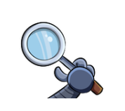
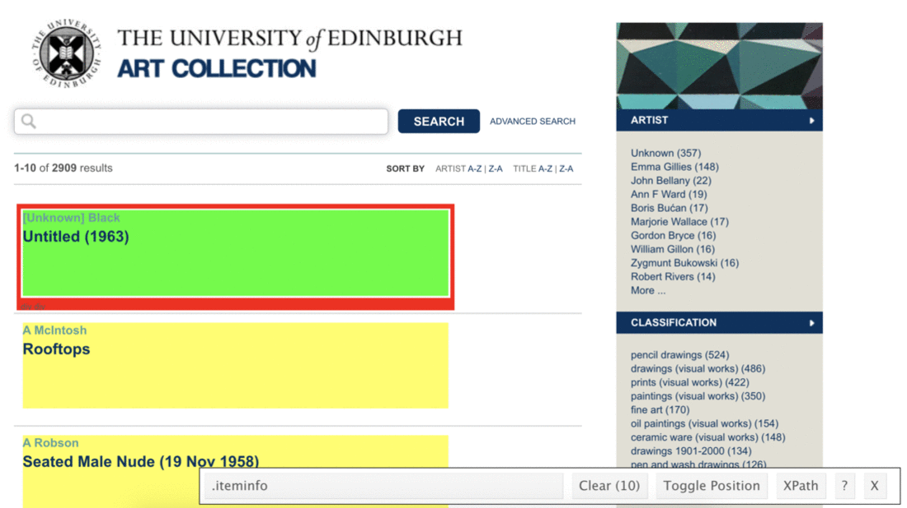

```{r setup, include=FALSE}
knitr::opts_chunk$set(eval = TRUE)
knitr::opts_knit$set(root.dir = "/Users/staceyhancock/Documents/Repos/stat408/stat408-s22.github.io/labs/lab-06")
library(robotstxt)
library(rvest)
library(tidyverse)
```

The University of Edinburgh Art Collection *"supports the world-leading research and teaching that happens within the University. Comprised of an astonishing range of objects and ideas spanning two millennia and a multitude of artistic forms, the collection reflects not only the long and rich trajectory of the University, but also major national and international shifts in art history."*[^lab-06-uoe-art-1].

```{marginfigure}
As of 2022-03-23, there were 2986 pieces in the art collection we're collecting data on. Note that more pieces may have been added or some pieces may have been removed between when this lab was written and when you're working on it.
```

In this lab we'll scrape data on all art pieces in the [Edinburgh College of Art collection](https://collections.ed.ac.uk/art/search/*:*/Collection:%22edinburgh+college+of+art%7C%7C%7CEdinburgh+College+of+Art%22).

# Learning goals

-   Working with R scripts
-   Web scraping from a single page
-   Writing functions
-   Iteration by mapping functions
-   Writing data out

# Lab prep

```{r selectorgadget, fig.margin = TRUE, echo = FALSE}

```

-   Download and install the SelectorGadget for your browser.
    Once you do, you should now be able to access SelectorGadget by clicking on the icon next to the search bar in your Chrome or Firefox browser.

    -   See [here](https://chrome.google.com/webstore/detail/selectorgadget/mhjhnkcfbdhnjickkkdbjoemdmbfginb) for Chrome (recommended)
    -   See [here](https://addons.mozilla.org/en-US/firefox/addon/chropath-for-firefox) for Firefox

-   Read the following on working with R Markdown documents vs. R scripts.

## R scripts vs. R Markdown documents

Today we will be using both R scripts and R Markdown documents:

-   `.R`: R scripts are plain text files containing **only** code and brief comments.

    -   We'll use R scripts in the web scraping stage and ultimately save the scraped data as a csv.

-   `.Rmd`: R Markdown documents are plain text files containing code, output, and narrative.

    -   We'll use an R Markdown document in the web analysis stage, where we start off by reading in the csv file we wrote out in the scraping stage.

Here is the organization of your repo, and the corresponding section in the lab that each file will be used for:

```{r, eval=FALSE}
|-data
|  |- README.md
|-lab-06.Rmd              # analysis
|-lab-06.Rproj            # your Rproj file
|-README.md
|-scripts                         # webscraping
|  |- 01-scrape-page-one.R        # scraping a single page
|  |- 02-scrape-page-function.R   # functions
|  |- 03-scrape-page-many.R       # iteration
```

Note that the repo does not initially include an .Rproj file.
This file will be created in your local directory when
you clone the repo in RStudio. Since .Rproj files are ignored
(see the .gitignore file), this file should not appear as
an option to commit and push to your repo.

# Getting started

Each member of the team should:

- Go to the course GitHub organization (or your team page) and locate your lab repo, which should be named `lab-06-uoe-art-YOUR_TEAM_NAME`.
- Grab the URL of the repo, and clone it in RStudio by creating a new project from Version Control with Git.
- Open the R Markdown document `lab-06.Rmd` and Knit it.
Make sure it compiles without errors.
The output will be in the file markdown `.md` file with the same name.


## Warm up

Before we introduce the data, let's warm up with some simple exercises.

-   Update the YAML of your R Markdown file with your team information and **knit** the document.
-   Commit your changes with a meaningful commit message.
-   Push your changes to GitHub.
-   Go to your repo on GitHub and confirm that your changes are visible in your Rmd **and** md files. If anything is missing, commit and push again.

## Packages

We'll use the **tidyverse** package for much of the data wrangling and visualization, the **robotstxt** package to check if we're allowed to scrape the data, and the **rvest** package for data scraping.
You can load them by running the following in your Console:

```{r eval = TRUE, message = FALSE}
library(tidyverse) 
library(robotstxt)
library(rvest)
```

## Data

This assignment does not come with any prepared datasets.
Instead you'll be scraping the data!
But before doing so, let's check that a bot has permissions to access pages on this domain.

```{r paths-allowed, warning=FALSE}
paths_allowed("https://collections.ed.ac.uk/art)")
```

# Exercises

## Scraping a single page

```{marginfigure}
**Tip:** To run the code in an .R script, you can highlight or put your cursor next to the lines of code you want to run and hit Ctrl+Enter or Command+Enter.
```

::: {.box}
Work in `scripts/01-scrape-page-one.R`.
:::

We will start off by scraping data on the first 10 pieces in the collection from [here](https://collections.ed.ac.uk/art/search/*:*/Collection:%22edinburgh+college+of+art%7C%7C%7CEdinburgh+College+of+Art%22?offset=0).

First, we define a new object called `first_url`, which is the link above.
Then, we read the page at this url with the `read_html()` function from the **rvest** package.
The code for this is already provided in `01-scrape-page-one.R`.

```{r}
# set url
first_url <- "https://collections.ed.ac.uk/art/search/*:*/Collection:%22edinburgh+college+of+art%7C%7C%7CEdinburgh+College+of+Art%22?offset=0"

# read html page
page <- read_html(first_url)
```

For the ten pieces on this page we will extract `title`, `artist`, and `link` information, and put these three variables in a data frame.

### Titles

Let's start with titles.
We make use of the SelectorGadget to identify the tags for the relevant elements. Check that the css selectors match those the code below (".iteminfo" and "h3 a").

```{r iteminfo-h3a, fig.margin = TRUE, echo = FALSE}

```

```{r}
page %>%
  html_elements(".iteminfo") %>%
  html_element("h3 a")
```

Then extract the text with `html_text()`:

```{r}
page %>%
  html_elements(".iteminfo") %>%
  html_element("h3 a") %>%
  html_text()
```

And get rid of all the spurious white space in the text with `str_squish()`, which reduces repeated whitespace inside a string.

```{marginfigure}
Take a look at the help for `str_squish()` to find out more about how it works and how it's different from `str_trim()`.
```

```{r}
page %>%
  html_elements(".iteminfo") %>%
  html_element("h3 a") %>%
  html_text() %>%
  str_squish()
```

And finally save the resulting data as a vector of length 10:

```{r}
titles <- page %>%
  html_elements(".iteminfo") %>%
  html_element("h3 a") %>%
  html_text() %>%
  str_squish()
```

1. Fill in the blanks to scrape titles.

### Links

The same elements that contain the text for the titles also contain information on the links to individual art piece pages for each title.
We can extract this information using a new function from the `rvest` package, `html_attr()`, which extracts attributes.

A mini HTML lesson!
The following is how we define hyperlinked text in HTML:

    <a href="https://www.google.com">Search on Google</a>

And this is how the text would look like on a webpage: [Search on Google](https://www.google.com).

Here the text is `Search on Google` and the `href` attribute contains the url of the website you'd go to if you click on the hyperlinked text: `https://www.google.com`.

The moral of the story is: the link is stored in the `href` attribute.

```{r}
page %>%
  html_elements(".iteminfo") %>%   # same elements
  html_element("h3 a") %>%         # as before
  html_attr("href")             # but get href attribute instead of text
```

These don't really look like URLs as we know them though.
They're *relative* links.

```{marginfigure}
See the help for `str_replace()` to find out how it works. Remember that the first argument is passed in from the pipeline, so you just need to define the `pattern` and `replacement` arguments.
```

Click on one of art piece titles in your browser and take note of the url of the webpage it takes you to. This url is an *absolute* url. 
Think about how the absolute url compares to what we scraped above? How is it different? 

2.  Using `str_replace()`, fill in the blank to change the relative URLs to absolute URLs. You'll note something special happening in the `pattern` to replace. We want to replace the `.`, but we have it as `\\.`. This is because the period `.` is a special character and so we need to escape it first with backslashes.

### Artists

3.  Fill in the blanks to scrape artist names.

### Put it altogether

4.  Fill in the blanks to organize everything in a tibble.

### Scrape the next page

5.  Click on the next ten results, and grab its url. Fill in the blank to define a new object: `second_url`. Copy-paste code from the top of the R script to scrape the new set of art pieces, and save the resulting data frame as `second_ten`.

✅ ⬆️ If you haven't done so recently, *commit and push your changes to GitHub with an appropriate commit message. Make sure to commit and push all changed files so that your Git pane is cleared up afterwards.*

## Functions

::: {.box}
Work in `scripts/02-scrape-page-function.R`.
:::

You've been using R functions, now it's time to write your own!
Remember that the skeleton for defining functions in R is as follows:

```{r eval=FALSE}
function_name <- function(input){
  # do something with the input(s)
  # return something
}
```

Thus, a function for scraping a webpage should look something like:

```{marginfigure}
**Reminder:** Function names should be short but evocative verbs.
```

```{r}
function_name <- function(url){
  # read page at url
  # extract title, link, artist info for n pieces on page
  # return a n x 3 tibble
}
```

6.  Fill in the blanks using code you already developed in the previous exercises. Name the function `scrape_page`.

Test out your new function by running the following in the console.
Does the output look right?
Discuss with teammates whether you're getting the same results as before.

```{r eval=FALSE}
scrape_page(first_url)
scrape_page(second_url)
```

✅ ⬆️ If you haven't done so recently, *commit and push your changes to GitHub with an appropriate commit message. Make sure to commit and push all changed files so that your Git pane is cleared up afterwards.*

## Iteration

::: {.box}
Work in `scripts/03-scrape-page-many.R`.
:::

We went from manually scraping individual pages to writing a function to do the same.
Next, we will work on making our workflow a little more efficient by using R to iterate over all pages that contain information on the art collection.

```{marginfigure}
**Reminder:** The collection has 2986 pieces in total (as of 2022-03-23).
```

That means we give develop a list of URLs (of pages that each have 10 art pieces), and write some code that applies the `scrape_page()` function to each page, and combines the resulting data frames from each page into a single data frame with 2986 rows and 3 columns.

### List of URLs

Click through the first few of the pages in the art collection and observe their URLs to confirm the following pattern:

    [sometext]offset=0     # Pieces 1-10
    [sometext]offset=10    # Pieces 11-20
    [sometext]offset=20    # Pieces 21-30
    [sometext]offset=30    # Pieces 31-40
    ...
    [sometext]offset=2960  # Pieces 2961-2970
    ...
    
```{marginfigure}
The `glue()` function lives in the `glue` R package. Load this package and then type `?glue` to examine its help file.
```


We can construct these URLs in R by pasting together two pieces: (1) a common (`root`) text for the beginning of the URL, and (2) numbers starting at 0, increasing by 10, all the way up to 2986.
Two new functions are helpful for accomplishing this: `glue()` for pasting two pieces of text and `seq()` for generating a sequence of numbers.

7.  Fill in the blanks to construct the list of URLs.

### Mapping

Finally, we're ready to iterate over the list of URLs we constructed.
We could do this using a **for** loop. But instead, we'll
learn a new, more efficient approach: **map**ping the function we developed over the list of URLs.

```{marginfigure}
The map functions live in the `purrr` R package, which is loaded when we load `tidyverse`. Type `?map` to examine the help file for these functions.
```


There are a series of mapping functions in R, and they each take the following form:

    map([x], [function to apply to each element of x])

In our case `x` is the list of URLs we constructed and the function to apply to each element of `x` is the function we developed earlier, `scrape_page`.
And as a result we want a data frame, so we use `map_dfr` function:

```{r eval=FALSE}
map_dfr(urls, scrape_page)
```

8.  Fill in the blanks to scrape all pages, and to create a new data frame called `uoe_art`. *Note*: This code will take a few minutes to run. Double-check that your function and urls are correct prior to running this line of code.

### Write out data

9.  Finally write out the data frame you constructed into the `data` folder so that you can use it in the analysis section. (The code to write out the data frame to a csv file is already included in the .R script file.)

::: {.marker}
Aim to make it to this point during the lab.
:::

✅ ⬆️ If you haven't done so recently, *commit and push your changes to GitHub with an appropriate commit message. Make sure to commit and push all changed files so that your Git pane is cleared up afterwards.*

## Analysis

::: {.box}
Work in `lab-06.Rmd` for the rest of the lab.
:::

Now that we have a tidy dataset that we can analyze, let's do that!

We'll start with some data cleaning, to clean up the dates that appear at the end of some title text in parentheses.
Some of these are years, others are more specific dates, some art pieces have no date information whatsoever, and others have some non-date information in parentheses.
This should be interesting to clean up!

First thing we'll try is to separate the `title` column into two: one for the actual `title` and the other for the `date` if it exists.
In human speak, we need to

> "separate the `title` column at the first occurrence of `(` and put the contents on one side of the `(` into a column called `title` and the contents on the other side into a column called `date`"

Luckily, there's a function in the `tidyr` package (part of the tidyverse) that does just this: `separate()`!

And once we have completed separating the single `title` column into `title` and `date`, we need to do further clean-up in the `date` column to get rid of extraneous `)`s with `str_remove()`, capture year information, and save the data as a numeric variable.

```{marginfigure}
**Hint:** Remember escaping special characters? You'll need to use that trick again.
```

10.  Fill in the blanks in to implement the data wrangling we described above. Note that this will result in some warnings when you run the code, and that's OK! Read the warnings, and explain what they mean, and why we are ok with leaving them in given that our objective is to just capture `year` where it's convenient to do so.

```{marginfigure}
The `skim()` function lives in the `skimr` package, which is loaded at the beginning of your .Rmd file.
```

11. Print out a summary of the data frame using the `skim()` function. How many pieces have artist info missing? How many have year info missing?

12. Make a histogram of years. (Always label your axes and include a title!) Use a reasonable binwidth. Do you see anything out of the ordinary?

```{marginfigure}
**Hint:** You'll want to use `mutate()` and `if_else()` or `case_when()` to implement the correction. *Do not modify the original csv file!*
```

13. Find which piece has the out of the ordinary year and go to its page on the art collection website to find the correct year for it. Can you tell why our code didn't capture the correct year information? Correct the error in the data frame and visualize the data again.

🧶 ✅ ⬆️ *If you haven't done so recently, knit, commit, and push your changes to GitHub with an appropriate commit message. Make sure to commit and push all changed files so that your Git pane is cleared up afterwards.*

14. Who is the most commonly featured artist in the collection? Do you know them? Any guess as to why the university has so many pieces from them?

```{marginfigure}
**Hint:** `str_subset()` can be helpful here. You should consider how you might capture titles where the word appears as "child" and "Child".
```

15. Final question! How many art pieces have the word "child" in their title? Try to figure it out, and ask for help on our D2L Discussion boards if you're stuck.

🧶 ✅ ⬆️ Knit, *commit, and push your changes to GitHub with an appropriate commit message. Make sure to commit and push all changed files so that your Git pane is cleared up afterwards and review the md document on GitHub to make sure you're happy with the final state of your work.*

# Attribution

This lab is adapted from material in the [Data Science in a Box](https://datasciencebox.org/index.html) course by Mine Çetinkaya-Rundel licensed under a [Creative Commons Attribution Share Alike 4.0 International](https://creativecommons.org/licenses/by-sa/4.0/).
Visit [here](https://github.com/rstudio-education/datascience-box/blob/master/LICENSE.md) for more information about the license.


[^lab-06-uoe-art-1]: Source: <https://collections.ed.ac.uk/art/about>
