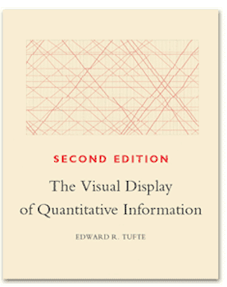
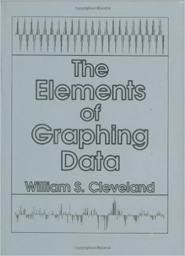
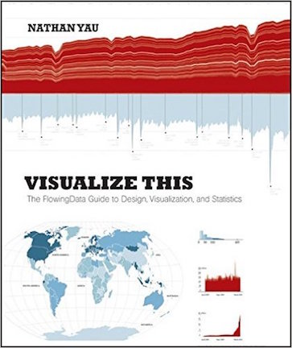
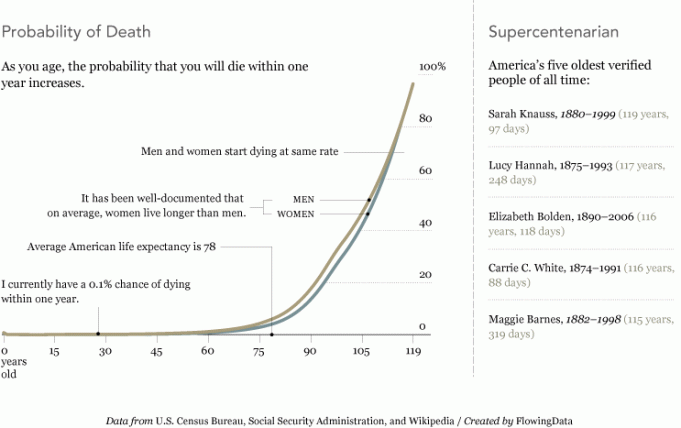
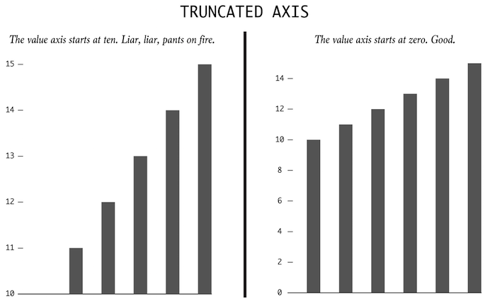

```{r setup, include=FALSE}
library(knitr)
library(tidyverse)
library(lubridate)
knitr::opts_chunk$set(echo = TRUE, warning=FALSE, error=FALSE, message=FALSE)
```

# Data Viz Resources

## Edward Tufte{.centered}


## William Cleveland{.centered}


## Nathan Yau ([FlowingData](https://flowingdata.com/)){.centered}


# Telling Stories with Data

## Telling Stories with Data{.centered}

](img/food.png)

<!-- Source: https://qz.com/862325/the-great-american-word-mapper/#int/words=brunch_grits_burrito_hoagie&smoothing=3 -->

## Telling Stories with Data

- What is Statistics?
    - hypothesis tests
    - pattern finding
    - predictive modeling
    - *storytelling with data* can help you solve real-world problems (predicting unrest, decreasing crime) or it can help you stay more informed

# Data viz is more than numbers

## Journalism{.centered}

](img/foodspending.png)
<!-- Source: https://archive.nytimes.com/www.nytimes.com/interactive/2008/05/03/business/20080403_SPENDING_GRAPHIC.html -->

## Art{.centered}
](img/VanGogh.png)

<!-- Source: https://www.smithsonianmag.com/smart-news/was-vincent-van-gogh-color-blind-it-sure-looks-like-it-27576085/ -->

<!-- Notes: -->
<!-- - images are data -->
<!-- - each pixel transformed to different color -->

## Entertainment{.centered}

](img/Kobe.png)
<!-- Source: https://graphics.latimes.com/kobe-every-shot-ever/ -->

## Compelling - Hans Rosling

```{r, fig.align='center', out.width="50%", echo=FALSE}
include_graphics(normalizePath("lectures/week10/img/Hans.jpg"))
```

[Hans Rosling's 200 Countries, 200 Years, 4 Minutes - The Joy of Stats - BBC Four](http://www.youtube.com/embed/jbkSRLYSojo?rel=0)


# Data Viz: What to look for

## Patterns{.centered}

```{r, fig.align='center', fig.cap="Why so many births around Sept. 25?", out.width="80%", echo=FALSE}
include_graphics("https://www.significancemagazine.com/images/significance/2017/Figures/births-fig1.PNG")
```

<!-- Source: https://www.significancemagazine.com/science/542-most-popular-birthday-england-wales -->

<!-- Notes: -->
<!-- - y-axis does not start at zero -->
<!-- - hospitals are closed over xmas -->
<!-- - nine months prior to Sept 25... -->

## Relationships{.centered}

](img/Punching.png)

<!-- Source: https://qz.com/582720/americas-most-prolific-wall-punchers-charted/ -->

# Design Principles

## Explain Encodings{.centered}
](img/emily.png)
<!-- Source: https://laughingsquid.com/maps-of-the-most-popular-baby-names-for-girls-from-1960-to-2012/ -->

## Explain Encodings{.centered}


## Label Axes{.centered}

```{r, fig.cap="[Calories for menu items](https://flowingdata.com/2016/12/12/calories-in-fast-food-menu-items/)", fig.align='center', out.width="60%", echo=FALSE}
include_graphics(normalizePath("lectures/week10/img/calories.png"))
```

<!-- Source: https://flowingdata.com/2016/12/12/calories-in-fast-food-menu-items/ -->

<!-- Notes: -->
<!-- - well-labeled axes -->
<!-- - legend -->
<!-- - annotations -->

## Keep Geometry in Check{.centered}

](img/moon.png)

<!-- Source: https://joshworth.com/dev/pixelspace/pixelspace_solarsystem.html -->

## Include Sources{.centered}




## Spotting Visualization Lies{.centered}



# Types of Graphs


## Why use Graphics

Why do you, or have you, in the past used data graphics?

- Exploratory Graphics
- Publication Graphics
- Presentation Graphics
    
## Basic Plots

```{r, echo=FALSE, fig.align='center', out.width="75%"}
include_graphics("https://mtstateintrostats.github.io/IntroStatTextbook/02-eda_files/figure-html/decision-tree-plots-1.png")
```

Source: [https://mtstateintrostats.github.io/IntroStatTextbook/index.html](https://mtstateintrostats.github.io/IntroStatTextbook/index.html)


# Interactive Graphics: R Shiny

## Overview of R Shiny 

R Shiny provides a way to create interactive visualizations and web applets.

There are two key components of an R Shiny Script:

1. The ui (user interface) provides a way for the user to interact with the visualization and for the program to capture input values.
2. The server piece takes those outputs and applies them to R code.

# Server Code

## Under the hood: Server Code
```{r, eval=F,mysize=TRUE,size = '\\footnotesize'}
# Define server logic required to draw a histogram
server <- function(input, output) {
  
  output$distPlot <- renderPlot({
    # generate bins based on input$bins from ui.R
    x    <- faithful[, 2] 
    bins <- seq(min(x), max(x), length.out = input$bins + 1)
    
    # draw the histogram with the specified number of bins
    hist(x, breaks = bins, col = 'darkgray', border = 'white')
  })
}
```


## Under the hood: Server Code - This is just R Code
```{r,eval=F,mysize=TRUE,size = '\\footnotesize'}
    input.bins <- 30 # number of bins
    x   <- faithful[, 2] 
    bins <- seq(min(x), max(x), length.out = input.bins + 1)
      # draw the histogram with the specified number of bins
    hist(x, breaks = bins, col = 'darkgray', border = 'white')
```


## Under the hood: Server Code
```{r, mysize=TRUE, eval=T, size='\\tiny',fig.align='center', echo = F}
    input.bins <- 30 # number of bins
    x   <- faithful[, 2] 
    bins <- seq(min(x), max(x), length.out = input.bins + 1)
      # draw the histogram with the specified number of bins
    hist(x, breaks = bins, col = 'darkgray', border = 'white')
```


## Under the hood: Server Code -  Change # of Bins
```{r, mysize=TRUE, eval=T, size='\\tiny',fig.align='center', echo = F}
    input.bins <- 15 # number of bins
    x   <- faithful[, 2] 
    bins <- seq(min(x), max(x), length.out = input.bins + 1)
      # draw the histogram with the specified number of bins
    hist(x, breaks = bins, col = 'darkgray', border = 'white')
```

# UI Code

## Under the Hood: UI Code
```{r,eval=F, mysize=TRUE, eval=F, size='\\footnotesize'}
# Define UI for application that draws a histogram
ui <- fluidPage(
   # Application title
   titlePanel("Old Faithful Geyser Data"),
   # Sidebar with a slider input for number of bins 
   sidebarLayout(
      sidebarPanel(
         sliderInput("bins", 
                     "Number of bins:",
                     min = 1,
                     max = 50,
                     value = 30)
      ),
      # Show a plot of the generated distribution
      mainPanel(
         plotOutput("distPlot")
      )
   )
)
```

## Shiny Code: Running the Application
```{r,eval=F, mysize=TRUE, eval=F, size='\\footnotesize'}
# Define server logic required to draw a histogram
server <- function(input, output) {
   
   output$distPlot <- renderPlot({
      # generate bins based on input$bins from ui.R
      x    <- faithful[, 2] 
      bins <- seq(min(x), max(x), length.out = input$bins + 1)
      
      # draw the histogram with the specified number of bins
      hist(x, breaks = bins, col = 'darkgray', border = 'white')
   })
}

# Run the application 
shinyApp(ui = ui, server = server)
```

## Shiny Output

```{r, fig.align='center', echo=FALSE, out.width="90%"}
include_graphics(normalizePath("lectures/week10/img/Shiny.png"))
```


## Demos

- Shiny Web Applet
- Shiny in RMarkdown HTML file
- [shinyapps.io](https://www.shinyapps.io/)


## Exercises

- Open the default Shiny Web App in R that contains the interactive histogram of Old faithful eruptions. Change the color of the histogram and reload the app.

- Open the default Shiny document R Markdown file and change the system file to use a different embedded Shiny application example than "06_tabsets".

## Shiny Apps to Demonstrate Shiny

- [Google Trend Index](https://shiny.rstudio.com/)
- [Shiny app with SAT data](https://r.amherst.edu/apps/nhorton/sat/) by Nick Horton
- [RStudio built-in Shiny examples](https://shiny.rstudio.com/articles/basics.html)

## Bonus Exercise

The `babynames` library contains a (giant) dataset called `babynames`, which contains the full baby name data provided by the Social Security Administration (SSA). Type the following to explore the data set and its variables:

```{r, eval = FALSE}
library(babynames)  # You will most likely have to install this
data(babynames)  # Load data into environment
?babynames
head(babynames)
```

Using the `babynames` data set, implement your own version of [this app](http://www.ssa.gov/oact/babynames/#ht=2) from the SSA.


# Graphics in R: Additional Slides

## Visualizing Patterns Over Time

- What are we looking for with data over time?
    - Trends (increasing/decreasing)
    - Are season cycles present?
- Identifying these patterns requires looking beyond single points
- We are also interested in looking at more the data in more detail
    - Are there outliers?
    - Do any time periods look out of place?
    - Are there spikes or dips?
    - What causes any of these irregularities?


## Capital Bikeshare Data

```{r , mysize=TRUE, size='\\tiny'}
bike.data <- read_csv('http://www.math.montana.edu/ahoegh/teaching/stat408/datasets/Bike.csv')
```

## Capital Bikeshare Data

```{r}
bike.data <- bike.data %>% mutate(year = as.factor(year(datetime)), month = as.factor(month(datetime)))
monthly.counts <- bike.data %>% group_by(month) %>% summarize(num_bikes = sum(count), .groups = 'drop') %>% arrange(month)
monthly.counts
```

## Discrete Points: Bar Charts

```{r, echo = F}
monthly.counts %>% ggplot(aes(y = num_bikes, x = month)) + geom_bar(stat = 'identity') + xlab('Month') + ylab('Bike Rentals') + labs(title = 'Bike Rentals per Month in 2011-2012 \n Capital Bikeshare in Washington, DC', caption = 'Source: www.capitalbikeshare.com')
```


## Discrete Points: Bar Charts - Code

```{r,echo=T,eval=F, mysize=TRUE, size='\\tiny'}
monthly.counts %>% 
  ggplot(aes(y = num_bikes, x = month)) + 
  geom_bar(stat = 'identity') + xlab('Month') + 
  ylab('Bike Rentals') + 
  labs(title = 'Bike Rentals per Month in 2011-2012 \n Capital Bikeshare in Washington, DC', 
       caption = 'Source: www.capitalbikeshare.com')
```

## Discrete Points: Stacked Bar 
```{r,echo=F,fig.align='center'}
bike.counts <- aggregate(cbind(bike.data$casual,bike.data$registered),by=list(bike.data$month), sum)
# Stacked Bar Plot with Colors and Legend
barplot(t(as.matrix(bike.counts[,-1])), 
        names.arg =collect(select(monthly.counts, month))[[1]], 
        xlab='Month', 
        sub ='Source: www.capitalbikeshare.com', ylab='Bike Rentals', main='Bike Rentals per Month in 2011 - 2012 \n Capital Bikeshare in Washington, DC', 
        col=c("darkblue","red"),legend.text = c("Casual", "Registered"),args.legend = list(x = "topleft"))
```

## Discrete Points in Time: Stacked Bar - Code
```{r,eval=F, mysize=TRUE, size='\\tiny'}
bike.counts <- aggregate(cbind(bike.data$casual,bike.data$registered),
                         by=list(bike.data$month), sum)
barplot(t(as.matrix(bike.counts[,-1])), 
        names.arg =collect(select(monthly.counts, month))[[1]], 
        xlab='Month', sub ='Source: www.capitalbikeshare.com', 
        ylab='Bike Rentals', 
        main='Bike Rentals per Month in 2011 - 2012 \n Capital Bikeshare in Washington, DC',
        col=c("darkblue","red"),legend.text = c("Casual", "Registered"),
        args.legend = list(x = "topleft"))
```

## Discrete Points in Time: Points
```{r,echo=F}
plot(rowSums(bike.counts[,-1])~bike.counts[,1],xlab='Month', sub ='Source: www.capitalbikeshare.com', 
        ylab='Bike Rentals', main='Bike Rentals per Month \n Capital Bikeshare in Washington, DC',
        col=c("darkblue"),pch=16)
```

## Discrete Points in Time: Points
```{r,echo=F}
plot(rowSums(bike.counts[,-1])~bike.counts[,1],xlab='Month', sub ='Source: www.capitalbikeshare.com', 
        ylab='Bike Rentals', main='Bike Rentals per Month \n Capital Bikeshare in Washington, DC',
        col=c("darkblue"),pch=16,ylim=c(0,max(rowSums(bike.counts[,-1]))),axes=F)
axis(2)
axis(1,at=1:12)
box()
```

## Discrete Points in Time: Points
```{r,eval=F, mysize=TRUE, size='\\tiny'}
plot(rowSums(bike.counts[,-1])~bike.counts[,1],xlab='Month',
     sub ='Source: www.capitalbikeshare.com', ylab='Bike Rentals', 
     main='Bike Rentals per Month \n Capital Bikeshare in Washington, DC',
     col=c("darkblue"),pch=16,axes=F,
     ylim=c(0,max(rowSums(bike.counts[,-1]))))
axis(2)
axis(1,at=1:12)
box()
```


## Connect the Dots
```{r,echo=F}
mean_temp <- bike.data %>% group_by(month) %>% summarize(mean_temp = mean(temp), .groups = 'drop') %>% mutate(month = as.numeric(month))

ggplot(aes(y=temp, x= month), data = bike.data) + geom_jitter(alpha = .1) + geom_line(inherit.aes = F, aes(y = mean_temp, x = month), data = mean_temp, color = 'red', lwd = 2) + ylab('Average Temp (C)') + xlab('Month') + labs(title = 'Average Temperature in Washington, DC', caption = 'Source: www.capitalbikeshare.com')
```

## Connect the Dots
```{r,eval=F, mysize=TRUE, size='\\tiny'}
mean_temp <- bike.data %>% group_by(month) %>%
  summarize(mean_temp = mean(temp),.groups = 'drop') %>% 
  mutate(month = as.numeric(month))

ggplot(aes(y=temp, x= month), data = bike.data) +
  geom_jitter(alpha = .1) + 
  geom_line(inherit.aes = F, aes(y = mean_temp, x = month),
            data = mean_temp, color = 'red', lwd = 2) +
  ylab('Average Temp (C)') + xlab('Month') + 
  labs(title = 'Average Temperature in Washington, DC', 
                       caption = 'Source: www.capitalbikeshare.com')
```

## Visualizing Proportions

- What to look for in proportions?
    - Generally looking for maximum, minimum, and overall distribution.
- Many of the figures we have discussed are useful here as well: for example, stacked bar charts or points to look at changes in proportions over time.
- Another possibility, which we will not cover, are plotting with rectangles known as a tree map.

## Visualizing Relationships

- When considering relationships between variables, what are we looking for?
    - If something goes up, do other variables have a positive relationship, negative relationship, or no relationship.
    - What is the distribution of your data? (both univariate and multivariate)
    


## Relationships: Scatterplots
```{r,echo=F}
bike.data$tempF <- bike.data$temp * 1.8 + 32
plot(bike.data$count~bike.data$tempF,pch=16,col=rgb(100,0,0,10,max=255),ylab='Hourly Bike Rentals',xlab='Temp (F)',sub ='Source: www.capitalbikeshare.com',main='Hourly Bike Rentals by Temperature')
bike.fit <- loess(count~tempF,bike.data)
temp.seq <- seq(min(bike.data$tempF),max(bike.data$tempF))
lines(predict(bike.fit,temp.seq)~temp.seq,lwd=2)
```


## Visualizing Relationships: Scatterplots - code
```{r, eval=F, mysize=TRUE, size='\\scriptsize'}
bike.data$tempF <- bike.data$temp * 1.8 + 32
plot(bike.data$count~bike.data$tempF,pch=16,
     col=rgb(100,0,0,10,max=255),ylab='Hourly Bike Rentals',
     xlab='Temp (F)',sub ='Source: www.capitalbikeshare.com',
     main='Hourly Bike Rentals by Temperature')
bike.fit <- loess(count~tempF,bike.data)
temp.seq <- seq(min(bike.data$tempF),max(bike.data$tempF))
lines(predict(bike.fit,temp.seq)~temp.seq,lwd=2)
```

## Visualizing Relationships: Multivariate Scatterplots
```{r,echo=T, mysize=TRUE, size='\\scriptsize'}
pairs(bike.data[,c(12,15,8)])
```

## Multivariate Scatterplots
```{r,echo=F, mysize=TRUE, size='\\scriptsize'}
par(mfcol=c(2,2),oma = c(1,0,0,0))
bike.data$tempF <- bike.data$temp * 1.8 + 32
plot(bike.data$count~bike.data$tempF,pch=16,col=rgb(100,0,0,10,max=255),
     ylab='Hourly Bike Rentals',xlab='Temp (F)',main='Hourly Bike Rentals by Temperature')
bike.fit <- loess(count~tempF,bike.data)
temp.seq <- seq(min(bike.data$tempF),max(bike.data$tempF))
lines(predict(bike.fit,temp.seq)~temp.seq,lwd=2)

plot(bike.data$count~bike.data$humidity,pch=16,col=rgb(100,0,100,10,max=255),
     ylab='Hourly Bike Rentals',xlab='Humidity (%)',main='Hourly Bike Rentals by Humidity')
bike.fit <- loess(count~humidity,bike.data)
humidity.seq <- seq(min(bike.data$humidity),max(bike.data$humidity))
lines(predict(bike.fit,humidity.seq)~humidity.seq,lwd=2)

plot(bike.data$count~bike.data$windspeed,pch=16,col=rgb(0,0,100,10,max=255),
     ylab='Hourly Bike Rentals',xlab='Windspeed (MPH)',main='Hourly Bike Rentals by Windspeed')
bike.fit <- loess(count~windspeed,bike.data)
windspeed.seq <- seq(min(bike.data$windspeed),max(bike.data$windspeed))
lines(predict(bike.fit,windspeed.seq)~windspeed.seq,lwd=2)

plot(bike.data$count~as.factor(bike.data$weather),col=rgb(0,100,0,255,max=255),
     ylab='Hourly Bike Rentals',xlab='Weather Conditions',main='Hourly Bike Rentals by Weather')

mtext('Source: www.capitalbikeshare.com', outer = TRUE, cex = .9, side=1)
par(mfcol=c(1,1),oma = c(0,0,0,0))
```

## Relationships: Multivariate Scatterplots 
```{r, eval=F, mysize=TRUE, size='\\tiny'}
par(mfcol=c(2,2),oma = c(1,0,0,0))
bike.data$tempF <- bike.data$temp * 1.8 + 32
plot(bike.data$count~bike.data$tempF,pch=16,col=rgb(100,0,0,10,max=255),
     ylab='Hourly Bike Rentals',xlab='Temp (F)',
     main='Hourly Bike Rentals by Temperature')
bike.fit <- loess(count~tempF,bike.data)
temp.seq <- seq(min(bike.data$tempF),max(bike.data$tempF))
lines(predict(bike.fit,temp.seq)~temp.seq,lwd=2)

plot(bike.data$count~bike.data$humidity,pch=16,
     col=rgb(100,0,100,10,max=255),
     ylab='Hourly Bike Rentals',xlab='Humidity (%)',
     main='Hourly Bike Rentals by Humidity')
bike.fit <- loess(count~humidity,bike.data)
humidity.seq <- seq(min(bike.data$humidity),max(bike.data$humidity))
lines(predict(bike.fit,humidity.seq)~humidity.seq,lwd=2)

plot(bike.data$count~bike.data$windspeed,pch=16,col=rgb(0,0,100,10,max=255),
     ylab='Hourly Bike Rentals',xlab='Windspeed (MPH)',main='Hourly Bike Rentals by Windspeed')
bike.fit <- loess(count~windspeed,bike.data)
windspeed.seq <- seq(min(bike.data$windspeed),max(bike.data$windspeed))
lines(predict(bike.fit,windspeed.seq)~windspeed.seq,lwd=2)

plot(bike.data$count~as.factor(bike.data$weather),col=rgb(0,100,0,255,max=255),
     ylab='Hourly Bike Rentals',xlab='Weather Conditions',main='Hourly Bike Rentals by Weather')

mtext('Source: www.capitalbikeshare.com', outer = TRUE, cex = .9, side=1)
par(mfcol=c(1,1),oma = c(0,0,0,0))

```


## Relationships: Histograms
```{r,  echo = F}
hist(bike.data$tempF,prob=T, main='Temperature (F)',col='red',xlab='')
```

## Relationships: Histograms
```{r,  eval = F}
hist(bike.data$tempF,prob=T, main='Temperature (F)',col='red',xlab='')
```


## Multiple Histograms
```{r,echo=F}
par(mfrow=c(2,1))
bike.data$reltempF <- bike.data$atemp * 1.8 + 32

hist(bike.data$tempF,prob=T,breaks='FD',
     main='Temperature (F)',col='red',xlab='',xlim=c(0,max(c(bike.data$reltempF,bike.data$tempF))))
hist(bike.data$reltempF,prob=T,breaks='FD',
     main='Relative Temperature (F)',col='orange',xlab='',
     xlim=c(0,max(c(bike.data$reltempF,bike.data$tempF))))
```


## Visualizing Relationships: Multiple Histograms - Code
```{r, eval=F, mysize=TRUE, size='\\footnotesize'}
par(mfrow=c(2,1))
bike.data$reltempF <- bike.data$atemp * 1.8 + 32

hist(bike.data$tempF,prob=T,breaks='FD',
     main='Temperature (F)',col='red',xlab='',
     xlim=c(0,max(c(bike.data$reltempF,bike.data$tempF))))
hist(bike.data$reltempF,prob=T,breaks='FD',
     main='Relative Temperature (F)',col='orange',xlab='',
     xlim=c(0,max(c(bike.data$reltempF,bike.data$tempF))))
```
