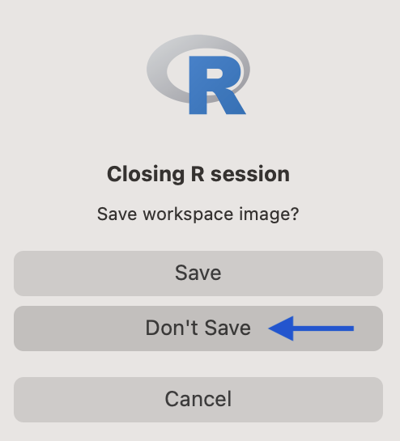

```{r setup, include=FALSE}
library(knitr)
library(tidyverse)
knitr::opts_chunk$set(echo = TRUE, warning=FALSE, error=FALSE, message=FALSE)
knitr::knit_hooks$set(mysize = function(before, options, envir) {
  if (before) 
    return(options$size)
})
```

# R Programming Style

## R Style Guide
While there is not universal agreement on programming style, there are two good examples:


1. Hadley Wickham's Style Guide:
[http://adv-r.had.co.nz/Style.html](http://adv-r.had.co.nz/Style.html)

2. Google R Style Guide: [https://google.github.io/styleguide/Rguide.xml](https://google.github.io/styleguide/Rguide.xml), which presents different options from Wickham's guide.

## Notation and Naming

**File Names:** File names should end in .R (script file) or .Rmd (R Markdown file) and be concise yet meaningful.

- Good: predict_ad_revenue.R
- Bad: foo.r

## Notation and Naming
  
**Identifiers:** Don't use hyphens or spaces in identifiers (or dots when naming functions).

- Tidyverse prefers "snake case": all lower case letters with words separated with underscores (`variable_name`)
- Google prefers "camel case":  `VariableName`
- Variable names should be nouns and function names should be verbs
- Avoid the names of existing functions!

```{r, eval = FALSE}
x <- 1:10
mean <- sum(x) # oh no!
```

    

## Syntax
- **Assignment:**
    - Use `<-` not `=` for assignment
- **Spacing:** 
    - Place spaces around all operators (`==, +, ...`) and assignment (`<-`)
    - Do not place a space before a comma, but always place one after a comma
    - Place a space before left parenthesis, except in a function call
    
## Pipes

Use `%>%` to emphasize a sequence of actions, rather than the object that the actions are being performed on.

Avoid using the pipe when:

- You need to manipulate more than one object at a time. Reserve pipes for a sequence of steps applied to one primary object.

- There are meaningful intermediate objects that could be given informative names.

## Pipes Style

- `%>%` should always have a space before and after
- One pipe per line
- After the first, indent each line two spaces, ending line with `%>%`
- If the arguments of a function don't fit on one line (less than 80 characters), put each argument on its own line and indent
- Styling suggestions for `+` connecting `ggplot()` commands are similar

## Exercise

```{r, eval=TRUE}
surveys <- read_csv("https://math.montana.edu/shancock/data/animal_survey.csv")
```

```{r, eval=FALSE}
# Clean up this code
surveys%>%filter(!is.na(weight) & !is.na(hindfoot_length)) %>%
select(sex, species, hindfoot_length, weight) %>% 
group_by(sex) %>%
summarize(mean_hindfoot_length=mean(hindfoot_length),mean_weight=mean(weight),n_species=n_distinct(species))
```


## Solution

```{r, eval=FALSE}
# your solutions here
```

## Solution

```{r, eval=FALSE}
surveys %>%
  filter(!is.na(weight) & !is.na(hindfoot_length)) %>%
  select(sex, species, hindfoot_length, weight) %>%
  group_by(sex) %>%
  summarize(
    mean_hindfoot_length = mean(hindfoot_length),
    mean_weight = mean(weight),
    n_species = n_distinct(species)
  )
```

## Operators in R

Most mathematical operators are self explanatory, but here are a few more important operators.

- `==` will test for equality. 
    * For example to determine if pi equals three, this can be evaluated with `pi == 3` in R and will return `r pi == 3 `. Note this operator returns a logical value.
- `&` is the AND operator, so `TRUE & FALSE` will return `r TRUE & FALSE`.
- `|` is the OR operator, so `TRUE | FALSE` will return `r TRUE | FALSE`.
- `!` is the NOT operator, so `! TRUE` will return `r  ! TRUE`.
- `^` permits power terms, so `4 ^ 2` returns `r 4^2` and `4 ^ .5` returns `r 4 ^ .5`.

Always type out `TRUE` and `FALSE` rather than `T` and `F`.

## Exercise: Order of operations
Note that order of operations is important in writing R code.
```{r opt,eval=F}
4 - 2 ^ 2
(4 - 2) ^ 2
5 * 2 - 3 ^ 2
pi == 3
! TRUE & pi == 3
! (TRUE | FALSE) 
```

Evaluate all  expressions. Note `!` is R's "not" operator.

## Solution: Order of operations
The results of the R code are:
```{r opt2, }
4 - 2 ^ 2
(4 - 2) ^ 2
5 * 2 - 3 ^ 2
```

## Solution: Order of operations
The results of the R code are:
```{r }
pi == 3
! TRUE & pi == 3
! (TRUE | FALSE) 
```

# Organization

## Layout of .R

The general layout of an R script (.R) should follow as:

1. Author comment
2. File description comment, including purpose of program, inputs, and outputs
3. `source()` and `library()` statements
4. Function definitions
5. Executed statements
  


## Layout of .Rmd

General guidelines for a reproducible R Markdown file (.Rmd):

- Code comments should be included in R chunks

- R chunks should always be named: `{r chunk_name, options}`

- Print out all code in documents

- R output should be integrated into text, using "r mean(x)" (using back ticks in place of quotes). _DO NOT_ hard code results in written text.

- Look at output to verify results look how you intended. Knit often!
  
## Commenting
- Comment your code. Entire commented lines should begin with `#` and then one space.
- Short comments can be placed after code preceded by two spaces, `#` and then one space.
```{r noeval, eval=FALSE}
# create plot of housing price by zipcode
plot(Seattle$Price ~ Seattle$Zip,
  rgb(.5,0,0,.7),  # set transparency for points
  xlab='zipode')
```
- (Cmd/Ctrl) + Shift + R is a shortcut to create a new section (particularly helpful in .R files): `# New section title ---------`

## Tables for R Markdown

Note that output from R can often be hard to read. Luckily there are several options for creating nicely formatted tables. One, which we will use, is the `kable()` function.

## Kable function
```{r kable, mysize=TRUE, size='\\small'}
library(knitr)
kable(
  aggregate(Loblolly$height, by = list(Loblolly$age), mean), 
  digits = 3,
  caption = 'Average height of loblolly pine by age',
  col.names = c('Tree Age','Height (ft)')
  )
```


## Workspace

Where does your analysis "live"?

- Environment (.RData)
- History (.Rhistory)


## Save workspace?

Use your R/Rmd files to recreate your environment. Reproducible research!

```{r, echo=FALSE, fig.align='center'}

```


---

RStudio > Preferences

```{r, echo=FALSE, fig.align='center'}
knitr::include_graphics("img/rstudio-workspace.png")
```


## Projects

Open RStudio, and type

```{r, eval=FALSE}
getwd()
```

- This is your "working directory" for the project.

Projects allow you to set your working directory and operate using **relative paths** rather than absolute paths in your code.

```{r, eval=FALSE}
# bad
read_csv("/Users/staceyhancock/Documents/stat408/data/nobel.csv")
# good
read_csv("data/nobel.csv")
```

## Parting Words
- Use common sense and *be consistent*.
- If you are editing code, take a few minutes to look at the code around you and mimic the style.
- Enough about writing code; the code itself is much more interesting. Have fun!

# Debugging

## Course Goals

With this class, we cannot cover every possible situation that you will encounter. The overall course goals are to:

1. Give you a broad range of tools that can be employed to manipulate, visualize, and analyze data, and
2. *teach you to find help when you or your code "gets stuck"*.


## Process for writing code

When writing code (and conducting statistical analyses) an iterative approach is a good strategy.

1. Test each line of code as you write it and if necessary confirm that nested functions are giving the desired results.
2. Start simple and then add more complexity.

## Debugging Overview


*Finding your bug is a process of confirming the many things 
that you believe are true -- until you find one which is not true.*  

-- Norm Matloff


## Debugging Guide 
We will first focus on debugging when an error, or warning is tripped.

1. Realize you have a bug (if error or warning, read the message)
2. Make it repeatable
3. Identify the problematic line (using print statements can be helpful)
4. Fix it and test it (evaluate nested functions if necessary)

## Warnings vs. Errors

R will flag, print out a message, in two cases: warnings and errors.

 - What is the difference between the two?
 - Is the R process treated differently for errors and warnings?
 
## Warnings vs. Errors

- Fatal errors are signaled with `stop()` and force all execution of code to stop triggering an `error`.
- Warnings are generated with `warning()` and display potential problems. Warnings **do not** stop code from executing.
- Messages can also be passed using `message()`, which pass along information.


## Bugs without warning/error

In other cases, we will have bugs in our code that don't necessarily give a warning or an error.

- How do we identify these bugs?
- How can we exit a case where:
    - R is running and may be stuck?
    - the code won't execute because of misaligned parenthesis, braces, brackets?

Note: `NA` values often return a warning message, but not always.


## Exercise

```{r, eval=FALSE}
surveys <- read_csv("https://math.montana.edu/shancock/data/animal_survey.csv")
```

Debug the following code:

```{r, eval=FALSE}
surveys %>%
  filter(!is.na(weight)) %>%
  group_by(sex) %>%
  summarize(
    mean-wgt = mean(weight),
    sd_wgt = sd(weight),
    max_wgt = max(weight)
  ) %>%
  select(weight, species) 
```

## Solution

```{r}
# your solution here
```


## Solution

```{r}
surveys %>%
  filter(!is.na(weight)) %>%
  group_by(sex) %>%
  select(weight, species) %>%
  summarize(
    mean_wgt = mean(weight),
    sd_wgt = sd(weight),
    max_wgt = max(weight)
  )
```

# Functions

## Built in R Functions

To get more details in R, type `?FunctionName`. This will open up a help window that displays essential characteristics of the function. For example, with the `mean` function the following information is shown:

**Description**: function for the (trimmed) arithmetic mean.

**Usage**: mean(x, trim = 0, na.rm = FALSE, ...)

**x**: An R object.

**trim:** the fraction (0 to 0.5) of observations to be trimmed from each end of x before the mean is computed. 

**na.rm:** a logical value indicating whether NA values should be stripped before the computation proceeds.


## Writing your own functions

Functions are a way to save elements of code to be used repeatedly.

### Syntax
```{r, eval=FALSE}
name_of_function <- function(arguments) {
  # Documentation
  body of function...
}
```

---

### Example
```{r}
RollDice <- function(num.rolls) {
  # 
  # ARGS: 
  # RETURNS: 
  sample(6, num.rolls, replace = T)
}
RollDice(2)
```

## Style: Functions

- Opening curly brace should never go on its own line and should always be followed by a new line
- Closing curly brace should always go on its own line, unless it’s followed by `else`
- If needed, place each argument on its own line, and indent to match the opening `(` of `function` OR double-indent (four spaces)
- Space between closing `)` of function arguments and start of function `{`


## Organization: Functions
Functions should contain a comments section immediately below the function definition line. These comments should consist of 

1. a one-sentence description; 
2. a list of the functions arguments, denoted by `Args:`, with a description of each and 
3. a description of the return value, denoted by `Returns:`. 
 
The comments should be descriptive enough that the function can be used without reading the function code.
 
## Exercise: Function Descriptions 
Document this function with 

1. a description,
2. summary of input(s)
3. summary of outputs

```{r}
RollDice <- function(num.rolls) {
  # 
  # ARGS:
  # RETURNS: 
  return(sample(6, num.rolls, replace = T))
}
```

## Solution: Function Descriptions 

```{r}
RollDice <- function(num.rolls) {
  # function that returns rolls of dice
  # ARGS: num.rolls - number of rolls
  # RETURNS: vector of num.rolls of a die
  return(sample(6, num.rolls, replace = T))
}
RollDice(2)
```


## Format of an R function
Here is an example (trivial) R function.
```{r func.def}
SquareRoot <- function(value.in) {
  # function takes square root of value.
  # Args: value.in - numeric value 
  # Returns: the square root of value.in
  value.in ^ .5
}
```

## Square Root Function
Now consider running the function for a few values.
```{r evalSQ}
SquareRoot(9)
SquareRoot(25)
```
Now what happens with `SquareRoot(-1)`?

## Square Root Function
```{r neqSQ}
SquareRoot(-1)
```
What should happen?

## Errors in R functions
Here is an example (trivial) R function.
```{r func.def.new}
SquareRoot <- function(value.in) {
  # function takes square root of value.
  # Args: value.in - numeric value 
  # Returns: the square root of value.in
  if (value.in < 0) {
    stop('argument less than zero')
  }
  value.in ^ .5
}
```

## Square Root Function
```{r neqSQ.new,eval=FALSE}
SquareRoot(-1)
```
This returns:
```{r error, eval=FALSE}
> SquareRoot(-1)
Error in SquareRoot(-1) : 
  argument less than zero
```

## Exercise: Writing and Documenting a Function
Use the defined style guidelines to create an R script that:

1. Takes a state abbreviation as an input
2. Imports a file available at:  [http://math.montana.edu/ahoegh/teaching/stat408/datasets/HousingSales.csv](http://math.montana.edu/ahoegh/teaching/stat408/datasets/HousingSales.csv)
3. Creates a subset of housing sales from that state
4. Returns a vector with the mean closing price in that state

Verify your functions works by running it twice using "MT" and "NE" as inputs.

## Solution: Writing and Documenting a Function
```{r, mysize=TRUE, size='\\tiny'}
SummarizeHousingCosts <- function(state) {
  # computes average sales price in a state
  # ARGS: state abbr, such as 'MT' or 'CA'
  # RETURNS: vector with average sales price that each state
  housing.data <- read.csv(
    'http://math.montana.edu/ahoegh/teaching/stat408/datasets/HousingSales.csv')
  location <- subset(housing.data, State == state)
  mean(location$Closing_Price)
}
```


```{r, mysize=TRUE, size='\\footnotesize'}
SummarizeHousingCosts('MT')
SummarizeHousingCosts('NE')
```

## Even better: Make pathname an argument
```{r, mysize=TRUE, size='\\tiny'}
SummarizeHousingCosts <- function(
    state,
    path
    ) {
  # computes average sales price in a state
  # ARGS: 
  #  state - abbr, such as 'MT' or 'CA'
  #  path - character pathname to data
  # RETURNS: vector with average sales price that each state
  housing.data <- read.csv(path)
  location <- subset(housing.data, State == state)
  mean(location$Closing_Price)
}
```

---

```{r, mysize=TRUE, size='\\footnotesize'}
SummarizeHousingCosts('MT', 
    path = 'http://math.montana.edu/ahoegh/teaching/stat408/datasets/HousingSales.csv')
```

Now what will happen if we try this code?
```{r, eval = FALSE}
SummarizeHousingCosts('MT')
```

## Even better: Make a default
```{r, mysize=TRUE, size='\\tiny'}
SummarizeHousingCosts <- function(
    state,
    path = 'http://math.montana.edu/ahoegh/teaching/stat408/datasets/HousingSales.csv'
    ) {
  # computes average sales price in a state
  # ARGS: 
  #  state - abbr, such as 'MT' or 'CA'
  #  path - character pathname to data
  # RETURNS: vector with average sales price that each state
  housing.data <- read.csv(path)
  location <- subset(housing.data, State == state)
  mean(location$Closing_Price)
}
```

```{r}
SummarizeHousingCosts('MT')
```

## Exercise: Functions Part 2
Now write a function that;

1. Takes daily snowfall total in inches as input
2. Takes day of week as input
3. Returns whether to ski or stay home.

Also include and the `stop()` function for errors.
Test this function with two settings:

 - snowfall = 15, day = "Sat"
 - snowfall = -1, day = "Mon"

## Solution: Functions Part 2
```{r}
ToSki <- function(snowfall, day) {
  # determines whether to ski or stay home
  # ARGS: snowfall in inches, day as three letter 
  #       abbrwith first letter capitalized
  # RETURNS: string stating whether to ski or not
  if (snowfall < 0) stop('snowfall should be greater 
        than or equal to zero inches')
  if (day == 'Sat') {
    print('Go Ski')
  } else if (snowfall > 5) {
    print('Go Ski')
  } else print('Stay Home')
}
```

## Solution: Functions Part 2 cont..
```{r, error = T, mysize=TRUE, size='\\small'}
ToSki(snowfall = 15, day = "Sat")
ToSki(-1, 'Mon')
```


