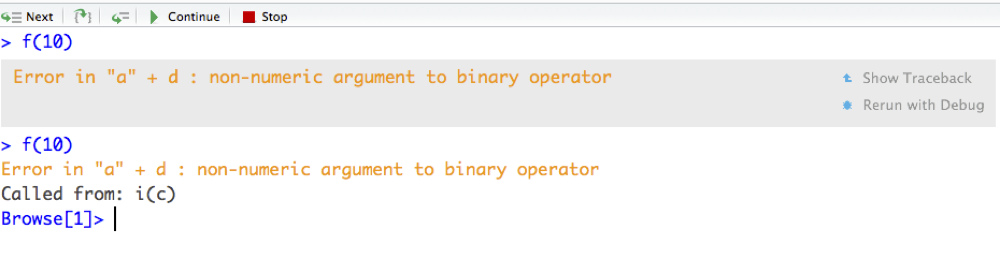

```{r setup, include=FALSE}
library(knitr)
library(tidyverse)
knitr::opts_chunk$set(echo = TRUE, warning=FALSE, error=FALSE, message=FALSE)
knitr::knit_hooks$set(mysize = function(before, options, envir) {
  if (before) 
    return(options$size)
})
```

# Simulation in R

## What is Simulation 
A few questions about simulation:

1. What does statistical simulation mean to you?

2. Describe a setting where simulation can be used.

## Simulation of Roulette
Consider the casino game Roulette.

```{r, out.width="40%", fig.align='center',echo=FALSE}

```

We can use simulation to evaluate gambling strategies.

## Roulette Simulation in R
```{r roulette, eval=TRUE}
RouletteSpin <- function(num.spins){
  # function to simulate roulette spins
  # ARGS: number of spins
  # RETURNS: result of each spin
  outcomes <- data.frame(number = c('00','0', as.character(1:36)),
                color=c('green','green','red','black','red','black',
                        'red','black','red','black','red','black',
                        'black','red','black','red','black',
                        'red','black','red','red','black',
                        'red','black','red','black','red',
                        'black','red','black','black','red',
                        'black','red','black','red','black','red'))
  return(outcomes[sample(38, num.spins, replace = TRUE),])
}
```

---

```{r}
kable(RouletteSpin(2), row.names=FALSE)
```

## Exercise: Probability of Red, Green, and Black
1. Calculate/derive the probability of landing on green, red, and black.

2. How can the `RouletteSpin()` function be used to compute or approximate these probabilities?

## Solution: Probability of Red, Green, and Black


In this situation, it is easy to compute the probabilities of each color analytically. However, consider simulating this process many times to estimate these probabilities.
```{r rouletteSpins, eval=TRUE}
num.sims <- 1000
spins <- RouletteSpin(num.sims)
p.red <- sum(spins[,2] == 'red') / num.sims
p.black <- sum(spins[,2] == 'black') / num.sims
p.green <- sum(spins[,2] == 'green') / num.sims
```
Analytically $P[red] = \frac{18}{38} =$ `r round(18/38,4)`, this is estimated as `r round(p.red,4)`. Similarly, $P[black] = \frac{18}{38} =$ `r round(18/38,4)`, this is estimated as `r round(p.black,4)` and $P[green] = \frac{2}{38} =$ `r round(2/38,4)`, this is estimated as `r round(p.green,4)`

## Exercise: Simulation Questions -- Part 2 

Now what happens if we:

1. run the simulation again with the same number of trials?

2. run the simulation with more trials, say 1 million?

## Solution: Simulation Questions -- Part 2

Run the simulation again with the same number of trials:
```{r}
num.sims <- 1000
spins <- RouletteSpin(num.sims)
p.red <- sum(spins[,2] == 'red') / num.sims
p.black <- sum(spins[,2] == 'black') / num.sims
p.green <- sum(spins[,2] == 'green') / num.sims
```
The simulated results are different
Analytically $P[red] = \frac{18}{38} =$ `r round(18/38,4)`, this is estimated as `r round(p.red,4)`. Similarly, $P[black] = \frac{18}{38} =$ `r round(18/38,4)`, this is estimated as `r round(p.black,4)` and $P[green] = \frac{2}{38} =$ `r round(2/38,4)`, this is estimated as `r round(p.green,4)`

## Solution: Simulation Questions -- Part 2

Run the simulation with more trials, say 1 million:

```{r}
num.sims <- 1000000
spins <- RouletteSpin(num.sims)
p.red <- sum(spins[,2] == 'red') / num.sims
p.black <- sum(spins[,2] == 'black') / num.sims
p.green <- sum(spins[,2] == 'green') / num.sims
```
Analytically $P[red] = \frac{18}{38} =$ `r round(18/38,4)`, this is estimated as `r round(p.red,4)`. Similarly, $P[black] = \frac{18}{38} =$ `r round(18/38,4)`, this is estimated as `r round(p.black,4)` and $P[green] = \frac{2}{38} =$ `r round(2/38,4)`, this is estimated as `r round(p.green,4)`


# Conditional Expressions in R

## Exercise: Conditions in R 
We have touched on many of these before, but here are some examples of expressions (conditions) in R. Evaluate these expressions:

```{r, eval=FALSE}
pi > 3 & pi < 3.5
c(1,3,5,7) %in% 1:3
1:3 %in% c(1,3,5,7)
rand.uniform <- runif(n = 1, min = 0, max = 1)
rand.uniform < .5
```

## Solutions: Conditions in R

```{r}
pi > 3 & pi < 3.5
c(1,3,5,7) %in% 1:3
1:3 %in% c(1,3,5,7)
rand.uniform <- runif(n = 1, min = 0, max = 1); rand.uniform
rand.uniform < .5
```

## Conditional Expression: If and Else
```{r}
print(rand.uniform)
```
Now what does this return?
```{r, eval=FALSE}
if (rand.uniform < .5){
  print('value less than 1/2')
} else {
    print('value greater than or equal to 1/2')
}
```

## Conditional Expression: If and Else
```{r}
print(rand.uniform)
if (rand.uniform < .5){
  print('value less than 1/2')
} else {
    print('value greater than or equal to 1/2')
}
```

## Conditional Expression: Vectorized?
Does this function accept a vector as an input?
```{r, eval=F}
rand.uniform2 <- runif(2)
print(rand.uniform2)
if (rand.uniform2 < .5){
  print('value less than 1/2')
} else {
    print('value greater than or equal to 1/2')
}
```

## Conditional Expression: Vectorized?

```{r, eval=T}
rand.uniform2 <- runif(2)
print(rand.uniform2)
if (rand.uniform2 < .5){
  'value less than 1/2'
} else {
    'value greater than 1/2'
}
```

## Conditional Expression: `ifelse()`
```{r}
print(rand.uniform2)
ifelse(rand.uniform2 < .5,'less than 1/2',
       'greater than 1/2')
```
The `ifelse()` function is vectorized and generally preferred with a single set of if/else statements.

## Exercise: Conditional Expression
Write a conditional statement that takes a playing card with two arguments, number (A, 2,..., 10, J, Q, K) and suit (C, D, H, S), and prints `Yes` if the card is a red face card and `No` otherwise.

- 4 of clubs: `card.number <- '4'` and `card.suit <- 'C'` 
- King of hearts: `card.number <-'K'` and `card.suit <- 'H'`

Verify this works using the following inputs:

- `card.number <- 'J'` and `card.suit <- 'D'`
- `card.number <- 'Q'` and `card.suit <- 'S'`


## Solution: Conditional Expression

```{r}
card.number <- 'J'
card.suit <- 'D'
ifelse(card.number %in% c('J','Q','K') & 
         card.suit %in% c('H','D'),'Yes','No')
card.number <- 'Q'
card.suit <- 'S'
ifelse(card.number %in% c('J','Q','K') & 
         card.suit %in% c('H','D'),'Yes','No')
```

# Loops

## for loops

When you want to do the same thing more than once:
```{r, eval=FALSE}
output <- vector("numeric", 100) # Set up empty object
for(i in LOOP_OVER_THIS_SEQUENCE) {
  # Repeat this code on each item in the sequence
  # Store in output vector
}
```

## for loops

What will each of these two loops print?

```{r}
rand.uniform2
```

```{r, eval=F}
for (i in seq_along(rand.uniform2)){
  print(i)
}
```
and
```{r, eval=F}
for (i in rand.uniform2){
  print(i)
}
```


## for loops
We can loop through a sequence or a vector.
```{r}
for (i in seq_along(rand.uniform2)){
  print(i)
}

for (i in rand.uniform2){
  print(i)
}
```

## While loops
An alternative to for loops is to use the while statement.

```{r, eval=FALSE}
set.seed(02012017)
total.snow <- 0
while (total.snow < 36){
  print(paste('need more snow, only have', 
              total.snow, 'inches'))
  total.snow <- total.snow + rpois(1,15)
}
  print(paste('okay, we now have', total.snow, 'inches'))
```

## Exercise: Loops

Assume you plan to wager $1 on red for ten roulette spins. If the outcome is red you win a dollar and otherwise you lose a dollar. Write a loop that simulates ten rolls and determines your net profit or loss.

```{r}
#hint: to get color from a single spin use
RouletteSpin(1)[2]
```

## Solution: Loops

Assume you plan to wager $1 on red for ten roulette spins. If the outcome is red you win a dollar and otherwise you lose a dollar. Write a loop that simulates ten rolls and determines your net profit or loss.

```{r}
profit <- 0
for (i in 1:10){
  ifelse(RouletteSpin(1)[2] == 'red',
         profit <- profit + 1, 
         profit <- profit - 1 )
}
profit
```


## Why not loops?
Some of you have seen or heard that loops in R should be avoided.

- **Why**: it has to do with how code is compiled in R. In simple terms, vectorized operations are much more efficient than loops.

- **How**: we have seen some solutions to this, explicitly using the apply class of functions. We can also write vectorized functions, consider the earlier roulette example where number of spins was an argument for the function.

# Monte Carlo Procedures

## Motivation for Monte Carlo procedures
Some probabilities can easily be calculated either intuitively or using pen and paper; however, as we have seen we can also simulate procedures to get an approximate answer.

Consider poker, where players are dealt a hand of five cards from a deck of 52 cards. What is the probability of being dealt a full house?

## Full House Probability Calculation 
Could we analytically compute this probability? **Yes** Is it an easy calculation? not necessarily. So consider a (Monte Carlo) simulation.
```{r}
DealPoker <- function(){
  # Function returns a hand of 5 cards
  
  
  
  
}
  
```

## Full House Probability Calculation
Could we analytically compute this probability? **Yes** Is it an easy calculation, not necessarily. So consider a (Monte Carlo) simulation.

```{r, eval=TRUE}
DealPoker <- function(){
  # Function returns a hand of 5 cards
  deck <- data.frame( suit = rep(c("H", "S","C","D"),each=13),
          card = rep(c('A',2:10,'J',"Q",'K'),4) )  
  return(deck[sample(52,5),])
}
```

## Full House Probability Calculation 
Next write another function to check if the hand is a full house.

```{r}
IsFullHouse <- function(hand){
  #determines whether a hand of 5 cards is a full house
  #ARGS: data frame of 5 cards
  #RETURNS: TRUE or FALSE
  cards <- hand[,2]
  num.unique <- length(unique(cards))
  ifelse(num.unique == 2, return(TRUE), return(FALSE)) 
}
```
Does this work? If not, what is the problem and how do we fix it?

## Full House Probability Calculation

```{r, eval=TRUE}
IsFullHouse <- function(hand){
  #determines whether a hand of 5 cards is a full house
  #ARGS: data frame of 5 cards
  #RETURNS: TRUE or FALSE
  cards <- hand[,2]
  num.unique <- length(unique(cards))
  num.appearances <- aggregate(rep(1,5),
                               list(cards),sum)
  max.appearance <- max(num.appearances[,2])
  ifelse(num.unique == 2 & max.appearance ==3,
         return(TRUE), return(FALSE)) 
}
```

## Full House Probability Calculation
```{r, eval=TRUE}
num.sims <- 1e5
sim.hands <- replicate(num.sims, DealPoker(), simplify=FALSE)
results <- lapply(sim.hands, IsFullHouse)
prob.full.house <- sum(unlist(results))/num.sims
```
Analytically the probability of getting a full house *can* be calculated as approximately 0.00144, with our simulation procedure we get `r prob.full.house`.

## Closing Thoughts on Monte Carlo
A few facts about Monte Carlo procedures:

- They return a random result due to randomness in the sampling procedures.
- The run-time (or number of iterations) is fixed and typically specified.
- Mathematically, Monte Carlo procedures are computing an integral or enumerating a sum.
- They take advantage of the law of large numbers.
- They were given the code name Monte Carlo in reference to the Monte Carlo Casino in Monaco. 


# Advanced Debugging

## Overview

We can often fix bugs using the ideas sketched out previously and this becomes *easier* with more experience coding in R. Trial and error can be very effective and strategic use of `print()` function help to identify where bugs are occuring.

However, R does also have advanced tools to help with debugging code.

- `traceback()`
-  "Rerun with debug"
-  `browser()`

## traceback()
Consider the following code:

```{r, error=TRUE, mysize=TRUE, size='\\small'}
f <- function(a) g(a) 
g <- function(b) h(b)
h <- function(c) i(c)
i <- function(d)  "a" + d
f(10)
```

## traceback()
Consider the `traceback()` function. Which identifies which functions have been executed (along with the row number of the function).

```{r,eval=FALSE}
> traceback()

4: i(c) at #1
3: h(b) at #1
2: g(a) at #1
1: f(10)
```
Note: due to the way that R Markdown is compiled, `traceback()` needs to be run directly in R, not R Markdown.

## Browsing on an error

Another option (in R Studio) is to browse on the error. This gives you an interactive way to move through the function calls to identify the problem of the location. This can also be called explicitly using `debug()`.

```{r, out.width="80%", echo=FALSE}

```

 
## browser()
 
The browser function can also be used to interactively step through a function.

```{r}
SS <- function(mu, x) {
  browser()
  d <- x - mu
  d2 <- d^2
  ss <- sum(d2)
  ss
}

```

 
 
## browser() step 1

```{r, out.width="80%", echo=FALSE}

```

## browser() step 2
 
```{r, out.width="80%", echo=FALSE}

``` 

## browser() step 3
 
```{r, out.width="80%", echo=FALSE}

```

## browser() step 4
 
```{r, out.width="80%", echo=FALSE}

```

## browser() step 5
 
```{r, out.width="80%", echo=FALSE}

```