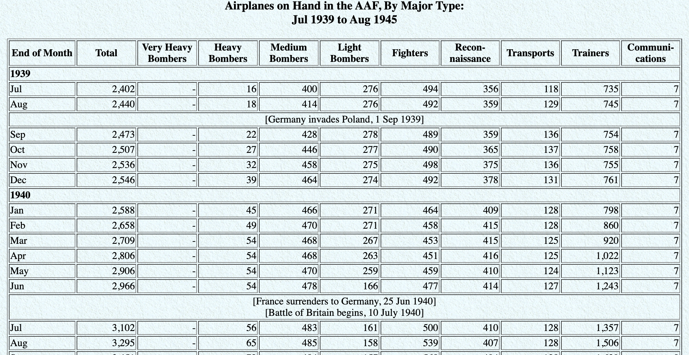

<!-- To enable presenter mode add ?presentme=true to the URL of the presentation. For example: -->

<!-- my-presentation.html?presentme=true -->

<!-- The presenter mode window will open and will always re-open with the presentation until it is disabled with: -->

<!-- my-presentation.html?presentme=false -->

```{r setup, include=FALSE}
library(knitr)
library(tidyverse)
library(kableExtra)
knitr::opts_chunk$set(echo = TRUE, warning=FALSE, error=FALSE, message=FALSE)
knitr::knit_hooks$set(mysize = function(before, options, envir) {
  if (before) 
    return(options$size)
})
```

# Data Wrangling

## Data Wrangling
As a statistician or more generally a data scientist the ability
to manipulate, process, clean, and merge datasets is an essential skill. 

- These skills are generally referred to as data wrangling or munging.
- In a data analysis or visualization setting, they will undoubtedly
require a majority of your time.
- Wrangling data can be a painful process.
- This lecture will provide some tools and examples of organizing data.

## Data Wrangling Concepts

- Wide and thin datasets
- Merging and joining relational data
- Dealing with strings
- Dealing with date/time objects


# Tidy Data

## Rules for Tidy Data
The concept of **tidy data** can be attributed to Hadley Wickham and has three principles for organizing data. [Tidy Data Reference](https://vita.had.co.nz/papers/tidy-data.pdf)

- Each variable forms a column.
- Each observation forms a row.
- Each type of observational unit forms a table (with a single value in each cell).


## Rules for Tidy Data


## Why use Tidy Data

*Tidy datasets are all alike, but every messy dataset is messy in its own way. - Hadley Wickham*

- Storing data in a consistent way gives familiarity with methods for manipulating data.
- Tidy data structure takes advantage of vectorised operations in R.
- Many useful packages: such as `dplyr` and `ggplot2` require tidy data.

## What are messy data?

```{r hyperwar-airplanes-on-hand, echo=FALSE, out.width="90%", fig.align = "center", caption = "WW2 Army Air Force combat aircraft", out.width = "70%"}

```

>- Year --> should be its own column
>- Historical markers --> could make into variables or just use on annotations

Source: [Army Air Forces Statistical Digest, WW II](https://www.ibiblio.org/hyperwar/AAF/StatDigest/aafsd-3.html)


## What are messy data?

```{r us-general-economic-characteristic-acs-2017, echo=FALSE, out.width="95%", fig.align = "center", caption = "US General Economic Characteristics, ACS 2017", out.width = "85%"}
knitr::include_graphics("img/us-general-economic-characteristic-acs-2017.png")
```

>- Data released in aggregate
>- Difficult to get data at the individual level (data privacy issues)

Source: [US Census Fact Finder, General Economic Characteristics, ACS 2017](https://factfinder.census.gov/faces/tableservices/jsf/pages/productview.xhtml?pid=ACS_17_5YR_DP03&src=pt)

## Displaying vs summarizing data

- Summary data might look "tidy", but its rows are not the observational units
- Raw data can produce summary data, but you can't go back to raw data from summary data

```{r load-recent-grads, echo=FALSE, eval=TRUE}
recent_grads <- read_csv("https://raw.githubusercontent.com/fivethirtyeight/data/master/college-majors/recent-grads.csv")
```

## Displaying vs summarizing data

Raw data or summary data?
```{r, echo=FALSE, eval=TRUE}
recent_grads %>% select(Major, ShareWomen, Unemployment_rate)
```

<div class="notes">
- Clue that you're looking at raw data --> number of rows equals number of observations
- What are the observational units in this data set? (majors)
- What if the observational units were graduates?
</div>

## Displaying vs summarizing data

Raw data or summary data?
```{r, echo=FALSE, eval=TRUE}
recent_grads %>% group_by(Major_category) %>% summarize(ave_med_salary = mean(Median))
```


# Merge / Join

## Merging in Base R

Consider the two data frames, how can we merge them and what should be the dimensions of the merged data frame.

<div class="columns-2">
```{r, echo = FALSE}
df1 <- data.frame(school = c('MSU','VT','Mines'),
            state= c('MT','VA','CO'), stringsAsFactors = F)
df1
```

```{r, echo = FALSE}
df2 <- data.frame(school = c('Mines','MSU','VT'),
            enrollment = c(5794,15688,30598), stringsAsFactors = F)
df2
```
</div>
## pre-sort
One possibility is to use the arrange the data frames first.

```{r}
df1 <- df1[order(df1$school),]
df2 <- df2[order(df2$school),]
```

## pre-sort
One possibility is to use the arrange the data frames first.

```{r}
df1 
df2 
```


## rbind() and cbind()

Now, given that the data frames are both sorted the same way, we can bind the columns together.

```{r}
comb_df <- cbind(df1,df2)
comb_df
comb_df <- comb_df[,-3]
```

## rbind() and cbind()
Now assume we want to add another school to the data frame.

```{r, error=TRUE}
new.school <- c('Luther', 'IA',2337)
rbind(comb_df, new.school)
```
Note: If your strings are saved as factors, this chunk of code will give you an error.


## bind_rows() / bind_cols()

`dplyr` also contains functions for 
- binding rows: `bind_rows()` 
- binding columns: `bind_cols()`


# Joins in `dplyr`

```{r include=FALSE}
professions <- read_csv("data/scientists/professions.csv")
dates <- read_csv("data/scientists/dates.csv")
works <- read_csv("data/scientists/works.csv")
```

## Data: Women in science 

Information on 10 women in science who changed the world.

```{r, echo=FALSE}
professions %>% select(name) %>% kable() %>%
kable_minimal()
```

Source: [Discover Magazine](https://www.discovermagazine.com/the-sciences/meet-10-women-in-science-who-changed-the-world)

## Inputs

```{r}
professions
```

## Inputs

```{r}
dates
```

## Inputs

```{r}
works
```


## Desired output

```{r echo=FALSE}
professions %>%
  left_join(dates) %>%
  left_join(works)
```


## Inputs, reminder

```{r, collapse=TRUE}
names(professions)
names(dates)
names(works)
```

```{r, collapse=TRUE}
nrow(professions)
nrow(dates)
nrow(works)
```


## Joining data frames

```{r eval=FALSE}
something_join(x, y)
```

- `left_join()`: all rows from x
- `right_join()`: all rows from y
- `full_join()`: all rows from both x and y
- `semi_join()`: all rows from x where there are matching values in y, keeping just columns from x
- `inner_join()`: all rows from x where there are matching values in y, return 
all combination of multiple matches in the case of multiple matches
- `anti_join()`: return all rows from x where there are not matching values in y, never duplicate rows of x
- ...


## Setup

For the next few slides...

<div class="columns-2">

```{r echo=FALSE}
x <- tibble(
  id = c(1, 2, 3),
  value_x = c("x1", "x2", "x3")
  )
```
```{r}
x
```


```{r echo=FALSE}
y <- tibble(
  id = c(1, 2, 4),
  value_y = c("y1", "y2", "y4")
  )
```
```{r}
y
```

</div>

## `left_join()`

<div class="columns-2">

```{r echo=FALSE, out.width="90%", out.extra ='style="background-color: #FDF6E3"'}
include_graphics("img/left-join.gif")
```
<br><br>
```{r}
professions %>%
  left_join(dates) 
```
</div>
 

## `right_join()`

<div class="columns-2">

```{r echo=FALSE, out.width="90%", out.extra ='style="background-color: #FDF6E3"'}
include_graphics("img/right-join.gif")
```

<br><br>
```{r}
professions %>%
  right_join(dates) 
```
</div> 
 

## `full_join()`


<div class="columns-2">

```{r echo=FALSE, out.width="90%", out.extra ='style="background-color: #FDF6E3"'}
include_graphics("img/full-join.gif")
```

<br><br>
```{r}
dates %>%
  full_join(works) 
```
</div> 
 

## `inner_join()`

<div class="columns-2">

```{r echo=FALSE, out.width="90%", out.extra ='style="background-color: #FDF6E3"'}
include_graphics("img/inner-join.gif")
```

<br><br>
```{r}
dates %>%
  inner_join(works) 
```

</div> 

## `semi_join()`

<div class="columns-2">

```{r echo=FALSE, out.width="90%", out.extra ='style="background-color: #FDF6E3"'}
include_graphics("img/semi-join.gif")
```

<br><br>
```{r}
dates %>%
  semi_join(works) 
```
</div> 
 

## `anti_join()`

<div class="columns-2">

```{r echo=FALSE, out.width="90%", out.extra ='style="background-color: #FDF6E3"'}
include_graphics("img/anti-join.gif")
```

<br><br>
```{r}
dates %>%
  anti_join(works) 
```
</div> 

## Putting it altogether

```{r}
professions %>%
  left_join(dates) %>%
  left_join(works)
```


# Exercise: Student records

 

## Student records

- Have:
  - Enrollment: official university enrollment records
  - Survey: Student provided info missing students who never filled it out and including students who filled it out but dropped the class
- Want: 
    - Survey info for all enrolled in class 
    - Students who are enrolled in class but missing survey
    - Students who took the survey but are no longer enrolled

```{r include=FALSE}
enrollment <- read_csv("data/students/enrollment.csv")
survey <- read_csv("data/students/survey.csv")
```

---

```{r message = FALSE}
enrollment
```

```{r message = FALSE}
survey
```


## Student records: Solution

### In class
```{r}
enrollment %>% 
  left_join(survey, by = "id")  
```

---

### Survey missing
```{r}
enrollment %>% 
  anti_join(survey, by = "id")  
```

---

### Dropped
```{r}
survey %>% 
  anti_join(enrollment, by = "id")  
```


# Exercise: Grocery sales


## Grocery sales

- Have:
  - Purchases: One row per customer per item, listing purchases they made
  - Prices: One row per item in the store, listing their prices
- Want: 
  - Total revenue (over all customers)
  - Revenue per customer
  
```{r include=FALSE}
purchases <- read_csv("data/sales/purchases.csv")
prices <- read_csv("data/sales/prices.csv")
```

---

<div class="columns-2">
```{r message = FALSE}
purchases
```

<br>
```{r message = FALSE}
prices
```
</div>

 

## Grocery sales: Solution

### Total revenue

<div class="columns-2">
```{r}
purchases %>% 
  left_join(prices)  
```

```{r}
purchases %>% 
  left_join(prices) %>%
  summarise(total_revenue = sum(price))  
```
</div>

---

### Revenue by customer
<div class="columns-2">

```{r}
purchases %>% 
  left_join(prices)
```


```{r}
purchases %>% 
  left_join(prices) %>%
  group_by(customer_id) %>%  
  summarise(total_revenue = sum(price))
```
</div>


# Exercise: Ski hills

## Ski hills

Combine the following information into a single table sorted alphabetically by the name of the ski hill.

```{r, echo = FALSE}
ski_acres <- data.frame( ski.hill = c('Big Sky','Bridger Bowl', 'Jackson', 'Steamboat' ), 
                        skiable.acres = c(5800,2000, "2500+",2965))
df_cost <- data.frame( ski.resort = c('Bridger Bowl', 'Big Sky', 'Steamboat', 'Jackson'), 
                       ticket.cost = c(60, 'depends',145, 130))
disco <- c('Discovery', 2200, 20)
```


<div class="columns-2">
```{r}
ski_acres
```
<br><br><br><br>
```{r}
df_cost
disco
```
</div>


## Solution option 1

```{r}
df_comb <- ski_acres %>% 
  full_join(df_cost, by = c("ski.hill" = "ski.resort")) %>%
  rbind(disco) %>% #<<<
  arrange(ski.hill)
str(df_comb)
```

## Solution option 2


```{r}
disco_df <- data.frame(matrix(disco, nrow = 1))
names(disco_df) <- c("ski.hill", "skiable.acres", "ticket.cost")
  
df_comb <- ski_acres %>% 
  full_join(df_cost, by = c("ski.hill"= "ski.resort")) %>%
  full_join(disco_df) %>% #<<<
  arrange(ski.hill)
str(df_comb)
```


# wide / long data

```{r include=FALSE}
customers <- read_csv("data/sales/customers.csv")
```

## wide(r) / long(er) data

We have data organised in an unideal way for our analysis.

We want to reorganise the data to carry on with our analysis.


## Data: Grocery sales

```{r include=FALSE}
customers <- read_csv("data/sales/customers.csv")
prices <- read_csv("data/sales/prices.csv")
```

<div class="columns-2">

We have...
```{r echo=FALSE}
customers
```
<br><br><br><br><br><br>

We want...
```{r echo=FALSE}
customers %>%
  pivot_longer(cols = item_1:item_3, names_to = "item_no", values_to = "item")
```
</div>

## A grammar of data tidying

<div class="columns-2">
```{r dplyr-part-of-tidyverse, echo=FALSE, out.width="60%", caption = "tidyr is part of the tidyverse"}
include_graphics("img/tidyr-part-of-tidyverse.png")
```

The goal of tidyr is to help you tidy your data via

- pivoting for going between wide and long data
- splitting and combining character columns
- nesting and unnesting columns
- clarifying how `NA`s should be treated
</div>


## Not this...

```{r echo=FALSE,out.width="70%", fig.align='center'}
include_graphics("img/pivot.gif")
```


## but this!


```{r echo=FALSE, fig.align='center', out.width="45%", out.extra ='style="background-color: #FDF6E3"'}
include_graphics("img/tidyr-longer-wider.gif")
```


## Wider vs. longer

<div class="columns-2">

Wider = more columns
```{r echo=FALSE}
customers
```

<br><br><br><br><br><br>

Longer = more rows
```{r echo=FALSE}
customers %>%
  pivot_longer(cols = item_1:item_3, names_to = "item_no", values_to = "item")
```

</div>

## `pivot_longer()`

<div class="columns-2">

>- `data` (as usual)
>- `cols`: columns to pivot into longer format 
>- `names_to`: name of the column where column names of pivoted variables go (character string)
>- `values_to`: name of the column where data in pivoted variables go (character string)


```{r eval=FALSE}
pivot_longer(
  data,
  cols, 
  names_to = "name", 
  values_to = "value"
  )
```

</div>


## Customers $\rightarrow$ purchases

```{r}
purchases <- customers %>%
  pivot_longer(
    cols = item_1:item_3,  # variables item_1 to item_3
    names_to = "item_no",  # column names -> new column called item_no
    values_to = "item"     # values in columns -> new column called item
    )

purchases
```


## Why pivot?

Most likely, because the next step of your analysis needs it

<div class="columns-2">
```{r}
prices
```

<br><br><br>
```{r}
purchases %>%
  left_join(prices)
```
</div>

## Purchases $\rightarrow$ customers

<div class="columns-2">

- `data` (as usual)
- `names_from`: which column in the long format contains the what should be column names in the wide format
- `values_from`: which column in the long format contains the what should be values in the new columns in the wide format

```{r}
purchases %>%
  pivot_wider( 
    names_from = item_no, 
    values_from = item 
  )
```

</div>
 
# Example: Billboard

## Example: Billboard

Consider the `billboard` dataset (contained in the `tidyr` package) which contains the rank of the song (in 2000) for each week after it first entered the list.

```{r}
billboard
```

## `billboard` data

If we want to identify songs that reach number 1 quickly, the data need to wrangled.
```{r}
billboard %>% 
  select(artist, track, date.entered, wk1, wk2) %>%
  pivot_longer(
  cols= c('wk1', 'wk2'),
  names_to = 'week',
  values_to = 'rank',
  values_drop_na = T)
```

## Billboard Data Analysis

```{r}
billboard %>% 
  pivot_longer(
  cols= starts_with('wk'),
  names_to = 'week',
  values_to = 'rank',
  values_drop_na = T) %>%
  mutate(week_numb= as.numeric(str_replace(week, 'wk',''))) %>%
  filter(rank == 1) %>%
  arrange(week_numb) %>% 
  slice(1) %>%
  kable()
```

## Exercise

Determine which song in this dataset spent the most time at #1.

## Solution: Code


```{r}
billboard_long <- billboard %>% 
  pivot_longer(
  cols= starts_with('wk'),
  names_to = 'week',
  values_to = 'rank',
  values_drop_na = TRUE) %>%
  mutate(week_numb = 
    as.numeric(str_replace(week, 'wk',''))) %>%
  filter(rank == 1) %>%
  group_by(track) %>% 
  tally() %>%
  arrange(desc(n))
```

## Solution: Result

```{r, echo=FALSE}
  kable(billboard_long[1:13,]) %>% kable_minimal()
```

