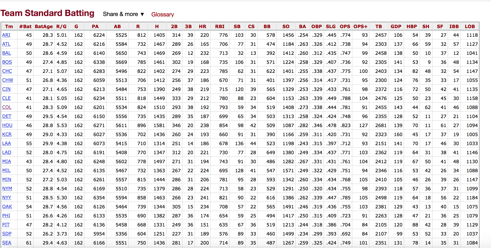

```{r setup, include=FALSE}
library(knitr)
library(tidyverse)
library(rvest)
library(robotstxt)
library(DBI)
library(RSQLite)
knitr::opts_chunk$set(echo = TRUE, warning=FALSE, error=FALSE, message=FALSE)
```

# Data Scraping 

## Web Scraping
- Increasing amount of data is available on the web

- These data are provided in an unstructured format: you can always copy&paste, but it's time-consuming and prone to errors

- Web scraping is the process of extracting this information automatically and transform it into a structured dataset

## Web Scraping

We could spend multiple weeks on this, so this will be a basic introduction that will allow you to:

- extract text and numbers from webpages and
- extract tables from webpages.

## Hypertext Markup Language

- Most of the data on the web is still largely available as HTML 
- It is structured (hierarchical / tree based), but it's often not available in a form useful for analysis (flat / tidy).

```html
<html>
  <head>
    <title>This is a title</title>
  </head>
  <body>
    <p align="center">Hello world!</p>
  </body>
</html>
```

## A bit about HTML

HTML elements are written with a start tag, an end tag, and with the content in between: <tagname>content</tagname>. The the textual content we wish to scrape typically lie between these tags. Some tags include:

- $<h1>$, $<h2>$,…,: for headings
-  $<p>$: Paragraph elements
- $<ul>$: Unordered bulleted list
- $<ol>$: Ordered list
- $<li>$: Individual List item
- $<div>$: Division or section
- $<table>$: Table

## HTML Example

https://math.montana.edu/

- Show html using "developer" tools

# Scraping with `rvest`

## Scraping with `rvest`

- The **rvest** package makes basic processing and manipulation of HTML data straight forward
- It's designed to work with pipelines built with `%>%`

## Core rvest functions

- `read_html`   - Read HTML data from a url or character string
- `html_element `  - Select a specified element (node) from HTML document
- `html_elements`  - Select specified elements (nodes) from HTML document
- `html_table`  - Parse an HTML table into a data frame
- `html_text`   - Extract tag pairs' content
- `html_name`   - Extract tags' names
- `html_attrs`  - Extract all of each tag's attributes
- `html_attr`   - Extract tags' attribute value by name


## Scraping with `rvest`
```{r}
library(rvest)
library(stringr)
msu.math <- read_html("http://math.montana.edu/")
msu.math
```

## Scraping with `rvest`
```{r}
 msu.math %>% html_elements('h1') 
 msu.math %>% html_elements('h1')  %>% html_text()
```

## Scraping h3
```{r}
msu.math %>% html_elements('h3') %>% html_text()
```

## Tidying Up
```{r}
msu.math %>% html_elements('h3') %>% html_text() %>% 
  str_replace_all("\\s+", " ") %>%
  str_replace_all(pattern = "\n", replacement = "") %>% 
  str_replace_all(pattern = "\t", replacement = "")
```

## SelectorGadget

- Open source tool that eases CSS selector generation and discovery
- Easiest to use with the [Chrome Extension](https://chrome.google.com/webstore/detail/selectorgadget/mhjhnkcfbdhnjickkkdbjoemdmbfginb) 
- Find out more on the [SelectorGadget vignette](https://rvest.tidyverse.org/articles/selectorgadget.html)


# Scraping Demo

## Scraping Demo: IMDB Top 120 Movies

Take a look at the source code, look for the `table` tag:
<br>
http://www.imdb.com/chart/top

### Steps

1. Read the whole page

2. Scrape movie titles and save as `titles` 

3. Scrape years movies were made in and save as `years`

4. Scrape IMDB ratings and save as `ratings`

5. Create a data frame called `imdb_top_250` with variables `title`, `year`, and `rating`


# Selecting Tables

## Selecting Tables: baseball data

https://www.baseball-reference.com/leagues/MLB/2017-standard-batting.shtml




## Scraping Tables
```{r}
batting <- read_html("https://www.baseball-reference.com/leagues/MLB/2017-standard-batting.shtml")
batting.list <- batting %>% html_elements('table') %>% html_table()
batting.df <- as_tibble(batting.list[[1]])
kable(batting.df)
```

## Scraping Exercise: Get Team Info
Visit the baseball reference website for the Colorado Rockies [https://www.baseball-reference.com/teams/COL/2017.shtml](https://www.baseball-reference.com/teams/COL/2017.shtml) and scrape a table or text.

## Scraping Solution: Get Team Info
```{r}
batting.CO <- read_html("https://www.baseball-reference.com/teams/COL/2017.shtml")
tables.CO <- batting.CO %>% html_elements('table') %>% html_table()
as_tibble(tables.CO[[1]])
```


# Additional Slides

## Web scraping considerations

[Slides](https://rstudio-education.github.io/datascience-box/course-materials/slides/u2-d20-considerations/u2-d20-considerations.html)

[Source](https://github.com/rstudio-education/datascience-box/tree/master/course-materials/slides/u2-d20-considerations)

[Video](https://youtu.be/LONRJHMvSyU)


## Using functions with web scraping 

[Slides](https://rstudio-education.github.io/datascience-box/course-materials/slides/u2-d21-functions/u2-d21-functions.html)

[Source](https://github.com/rstudio-education/datascience-box/tree/master/course-materials/slides/u2-d21-functions)

[Video](https://youtu.be/6KWlPhPMluE)

## Using iteration with web scraping

[Slides](https://rstudio-education.github.io/datascience-box/course-materials/slides/u2-d22-iteration/u2-d22-iteration.html)

[Source](https://github.com/rstudio-education/datascience-box/tree/master/course-materials/slides/u2-d22-iteration)

[Video](https://youtu.be/x3UMny1fQhc)

